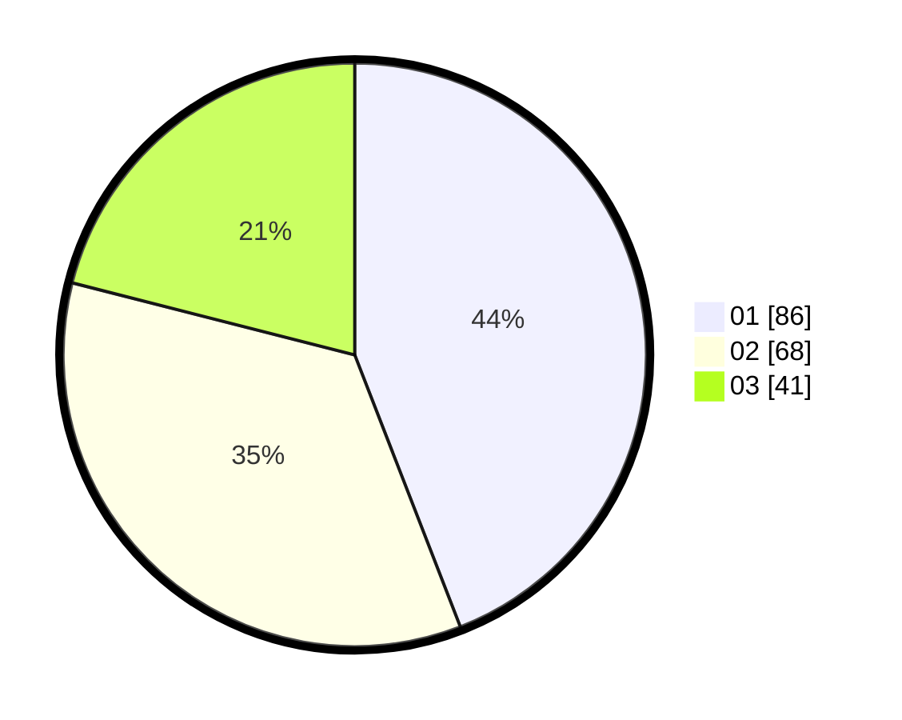

# Hasil

Hasil perolehan suara paslon dapat dilihat pada file paslon-01.txt, paslon-02.txt, dan paslon-03.txt.

Jika tidak ada, artinya data tersebut belum ada pada SIREKAP.

## Perolehan Suara

 * Paslon 01: **86**.
 * Paslon 02: **68**.
 * Paslon 03: **41**.

## Foto C Plano

https://sirekap-obj-formc.kpu.go.id/fbf7/pemilu/ppwp/31/75/06/10/03/3175061003238-20240216-001119--94650fd2-afb9-4bf7-b2d8-c518a1cd6ee2.jpg

https://sirekap-obj-formc.kpu.go.id/fbf7/pemilu/ppwp/31/75/06/10/03/3175061003238-20240216-001122--bbf57563-8888-44b4-9ce6-e5d9641d8e07.jpg

https://sirekap-obj-formc.kpu.go.id/fbf7/pemilu/ppwp/31/75/06/10/03/3175061003238-20240216-001121--7ebfa365-5660-4f75-b9aa-f8bb6de1f928.jpg

## DATA PEMILIH TETAP

Jumlah pemilih dalam DPT: **261**.
 * L: **135**.
 * P: **126**.

## DATA PENGGUNA HAK PILIH

Jumlah pengguna hak pilih dalam DPT: **189**.
 * L: **99**.
 * P: **90**.

Jumlah pengguna hak pilih dalam DPTb: **3**.
 * L: **1**.
 * P: **2**.

Jumlah pengguna hak pilih dalam DPK: **5**.
 * L: **2**.
 * P: **3**.

Jumlah pengguna hak pilih: **197**.
 * L: **102**.
 * P: **95**.

## JUMLAH SUARA SAH DAN TIDAK SAH

JUMLAH SELURUH SUARA SAH: **195**.

JUMLAH SUARA TIDAK SAH: **2**.

JUMLAH SELURUH SUARA SAH DAN SUARA TIDAK SAH: **197**.
