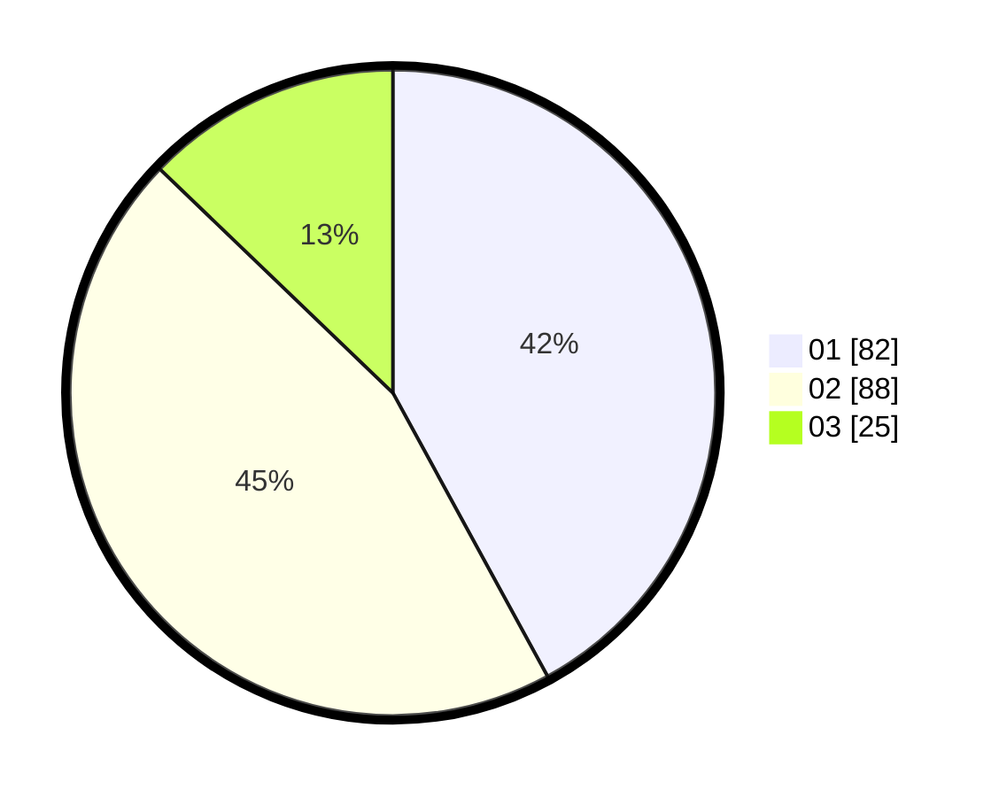

# Hasil

Hasil perolehan suara paslon dapat dilihat pada file paslon-01.txt, paslon-02.txt, dan paslon-03.txt.

Jika tidak ada, artinya data tersebut belum ada pada SIREKAP.

## Perolehan Suara

 * Paslon 01: **82**.
 * Paslon 02: **88**.
 * Paslon 03: **25**.

## Foto C Plano

https://sirekap-obj-formc.kpu.go.id/9126/pemilu/ppwp/31/75/06/10/03/3175061003243-20240216-033751--3452df81-2c68-4e3e-b058-6ae118585794.jpg

https://sirekap-obj-formc.kpu.go.id/9126/pemilu/ppwp/31/75/06/10/03/3175061003243-20240216-033753--4ec98efb-de8f-43fd-9181-ab565ca394f9.jpg

https://sirekap-obj-formc.kpu.go.id/9126/pemilu/ppwp/31/75/06/10/03/3175061003243-20240216-033752--39a4f643-e446-4b4e-8fbc-15b3c4271236.jpg

## DATA PEMILIH TETAP

Jumlah pemilih dalam DPT: **288**.
 * L: **149**.
 * P: **139**.

## DATA PENGGUNA HAK PILIH

Jumlah pengguna hak pilih dalam DPT: **181**.
 * L: **88**.
 * P: **93**.

Jumlah pengguna hak pilih dalam DPTb: **10**.
 * L: **9**.
 * P: **1**.

Jumlah pengguna hak pilih dalam DPK: **4**.
 * L: **1**.
 * P: **3**.

Jumlah pengguna hak pilih: **195**.
 * L: **98**.
 * P: **97**.

## JUMLAH SUARA SAH DAN TIDAK SAH

JUMLAH SELURUH SUARA SAH: **195**.

JUMLAH SUARA TIDAK SAH: **0**.

JUMLAH SELURUH SUARA SAH DAN SUARA TIDAK SAH: **195**.
