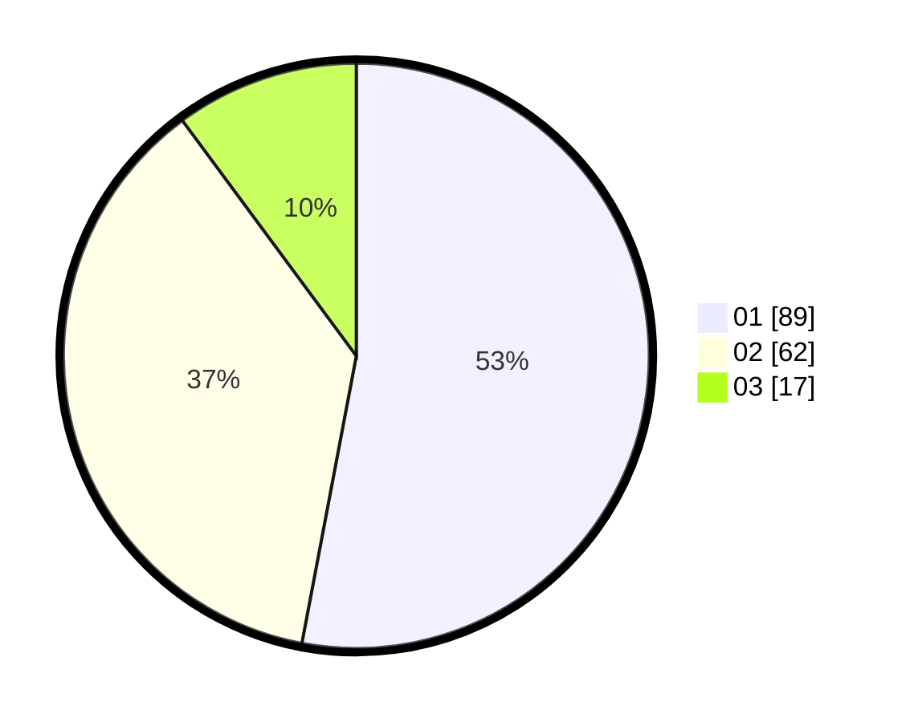

# Hasil

Hasil perolehan suara paslon dapat dilihat pada file paslon-01.txt, paslon-02.txt, dan paslon-03.txt.

Jika tidak ada, artinya data tersebut belum ada pada SIREKAP.

## Perolehan Suara

 * Paslon 01: **89**.
 * Paslon 02: **62**.
 * Paslon 03: **17**.

## Foto C Plano

https://sirekap-obj-formc.kpu.go.id/f249/pemilu/ppwp/31/75/06/10/03/3175061003245-20240215-214757--6db11f57-1624-4828-a341-b58207fc9716.jpg

https://sirekap-obj-formc.kpu.go.id/f249/pemilu/ppwp/31/75/06/10/03/3175061003245-20240215-214800--d1ac4601-af13-4dd8-912d-c4703f35ef92.jpg

https://sirekap-obj-formc.kpu.go.id/f249/pemilu/ppwp/31/75/06/10/03/3175061003245-20240215-214758--2fbf487a-d0d5-4496-9bbf-59de8b73e0ce.jpg

## DATA PEMILIH TETAP

Jumlah pemilih dalam DPT: **242**.
 * L: **124**.
 * P: **118**.

## DATA PENGGUNA HAK PILIH

Jumlah pengguna hak pilih dalam DPT: **172**.
 * L: **84**.
 * P: **88**.

Jumlah pengguna hak pilih dalam DPTb: **0**.
 * L: **0**.
 * P: **0**.

Jumlah pengguna hak pilih dalam DPK: **1**.
 * L: **1**.
 * P: **0**.

Jumlah pengguna hak pilih: **173**.
 * L: **85**.
 * P: **88**.

## JUMLAH SUARA SAH DAN TIDAK SAH

JUMLAH SELURUH SUARA SAH: **168**.

JUMLAH SUARA TIDAK SAH: **5**.

JUMLAH SELURUH SUARA SAH DAN SUARA TIDAK SAH: **5**.
