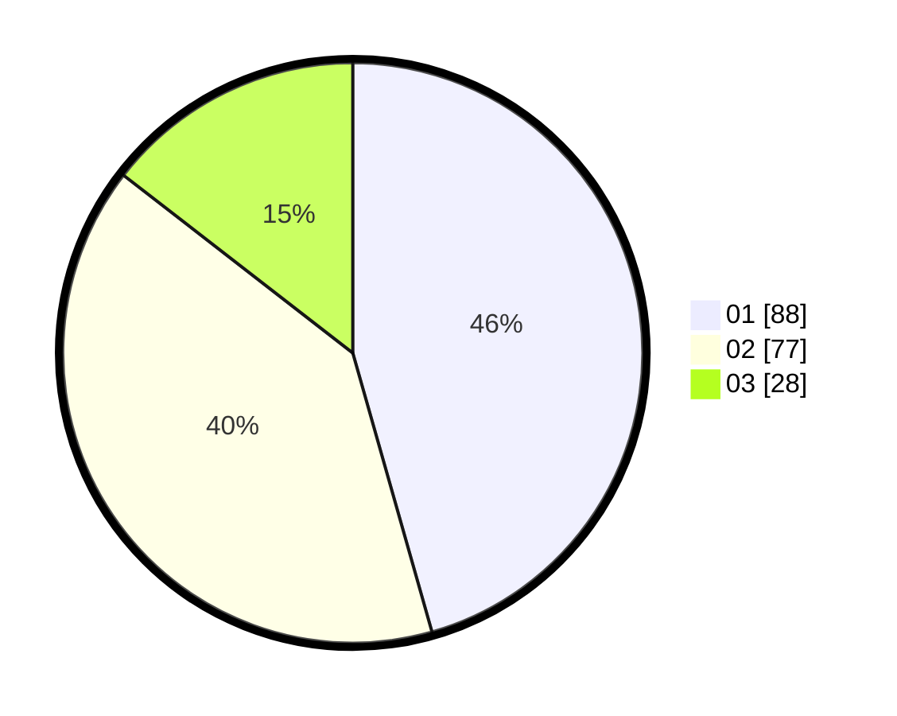

# Hasil

Hasil perolehan suara paslon dapat dilihat pada file paslon-01.txt, paslon-02.txt, dan paslon-03.txt.

Jika tidak ada, artinya data tersebut belum ada pada SIREKAP.

## Perolehan Suara

 * Paslon 01: **88**.
 * Paslon 02: **77**.
 * Paslon 03: **28**.

## Foto C Plano

https://sirekap-obj-formc.kpu.go.id/e8e3/pemilu/ppwp/31/75/06/10/03/3175061003247-20240215-010013--15d8fe14-e6b7-4f14-8031-3faaf1f2958b.jpg

https://sirekap-obj-formc.kpu.go.id/e8e3/pemilu/ppwp/31/75/06/10/03/3175061003247-20240215-010027--4f4cf947-4a37-4fdc-a80a-f7dd5f2a39bd.jpg

https://sirekap-obj-formc.kpu.go.id/e8e3/pemilu/ppwp/31/75/06/10/03/3175061003247-20240215-010035--4bb128f8-2301-4009-a7c8-6ae64abff584.jpg

## DATA PEMILIH TETAP

Jumlah pemilih dalam DPT: **269**.
 * L: **131**.
 * P: **138**.

## DATA PENGGUNA HAK PILIH

Jumlah pengguna hak pilih dalam DPT: **196**.
 * L: **91**.
 * P: **105**.

Jumlah pengguna hak pilih dalam DPTb: **0**.
 * L: **0**.
 * P: **0**.

Jumlah pengguna hak pilih dalam DPK: **0**.
 * L: **0**.
 * P: **0**.

Jumlah pengguna hak pilih: **196**.
 * L: **91**.
 * P: **105**.

## JUMLAH SUARA SAH DAN TIDAK SAH

JUMLAH SELURUH SUARA SAH: **193**.

JUMLAH SUARA TIDAK SAH: **3**.

JUMLAH SELURUH SUARA SAH DAN SUARA TIDAK SAH: **196**.
