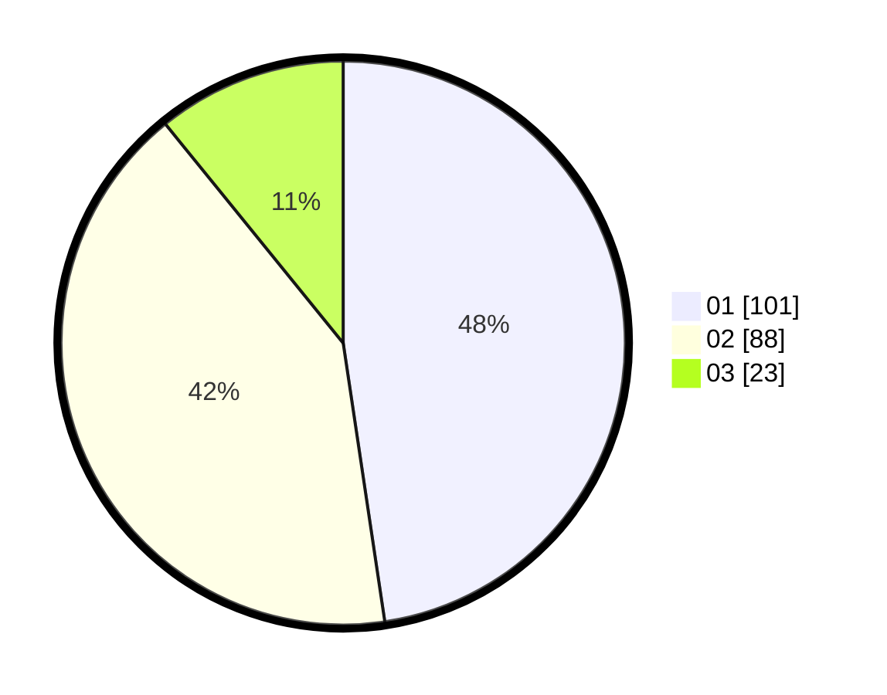

# Hasil

Hasil perolehan suara paslon dapat dilihat pada file paslon-01.txt, paslon-02.txt, dan paslon-03.txt.

Jika tidak ada, artinya data tersebut belum ada pada SIREKAP.

## Perolehan Suara

 * Paslon 01: **101**.
 * Paslon 02: **88**.
 * Paslon 03: **23**.

## Foto C Plano

https://sirekap-obj-formc.kpu.go.id/5170/pemilu/ppwp/31/75/06/10/03/3175061003248-20240215-212113--fe7bbceb-3a66-43db-8a65-f146a50a66f8.jpg

https://sirekap-obj-formc.kpu.go.id/5170/pemilu/ppwp/31/75/06/10/03/3175061003248-20240215-212122--ff5caf7d-301c-41ac-be89-b7312463dd52.jpg

https://sirekap-obj-formc.kpu.go.id/5170/pemilu/ppwp/31/75/06/10/03/3175061003248-20240215-212121--5e754175-ef88-42b8-8cb9-f3992e23b74c.jpg

## DATA PEMILIH TETAP

Jumlah pemilih dalam DPT: **280**.
 * L: **147**.
 * P: **133**.

## DATA PENGGUNA HAK PILIH

Jumlah pengguna hak pilih dalam DPT: **216**.
 * L: **111**.
 * P: **105**.

Jumlah pengguna hak pilih dalam DPTb: **0**.
 * L: **0**.
 * P: **0**.

Jumlah pengguna hak pilih dalam DPK: **1**.
 * L: **1**.
 * P: **0**.

Jumlah pengguna hak pilih: **217**.
 * L: **112**.
 * P: **105**.

## JUMLAH SUARA SAH DAN TIDAK SAH

JUMLAH SELURUH SUARA SAH: **212**.

JUMLAH SUARA TIDAK SAH: **5**.

JUMLAH SELURUH SUARA SAH DAN SUARA TIDAK SAH: **217**.
