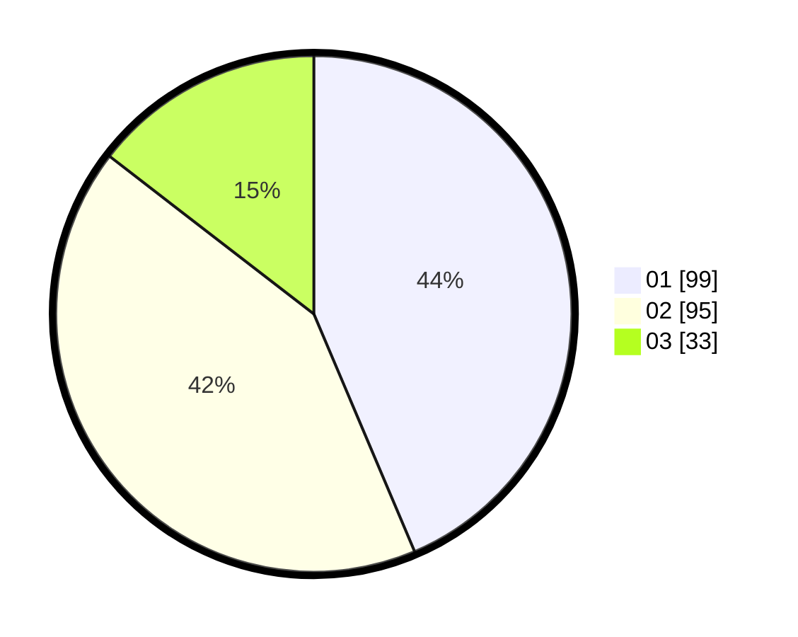

# Hasil

Hasil perolehan suara paslon dapat dilihat pada file paslon-01.txt, paslon-02.txt, dan paslon-03.txt.

Jika tidak ada, artinya data tersebut belum ada pada SIREKAP.

## Perolehan Suara

 * Paslon 01: **99**.
 * Paslon 02: **95**.
 * Paslon 03: **33**.

## Foto C Plano

https://sirekap-obj-formc.kpu.go.id/068b/pemilu/ppwp/31/75/06/10/03/3175061003249-20240214-190817--5c8a897a-750f-4f2a-8b8d-dd619eba5df0.jpg

https://sirekap-obj-formc.kpu.go.id/068b/pemilu/ppwp/31/75/06/10/03/3175061003249-20240214-192228--980f9fb1-0eac-4ce7-926d-5ffd4a6a4d37.jpg

https://sirekap-obj-formc.kpu.go.id/068b/pemilu/ppwp/31/75/06/10/03/3175061003249-20240214-192432--f24a9149-c0cc-465b-9abd-e082b9eca713.jpg

## DATA PEMILIH TETAP

Jumlah pemilih dalam DPT: **269**.
 * L: **133**.
 * P: **136**.

## DATA PENGGUNA HAK PILIH

Jumlah pengguna hak pilih dalam DPT: **220**.
 * L: **102**.
 * P: **118**.

Jumlah pengguna hak pilih dalam DPTb: **1**.
 * L: **1**.
 * P: **0**.

Jumlah pengguna hak pilih dalam DPK: **8**.
 * L: **3**.
 * P: **5**.

Jumlah pengguna hak pilih: **229**.
 * L: **106**.
 * P: **123**.

## JUMLAH SUARA SAH DAN TIDAK SAH

JUMLAH SELURUH SUARA SAH: **227**.

JUMLAH SUARA TIDAK SAH: **2**.

JUMLAH SELURUH SUARA SAH DAN SUARA TIDAK SAH: **229**.
