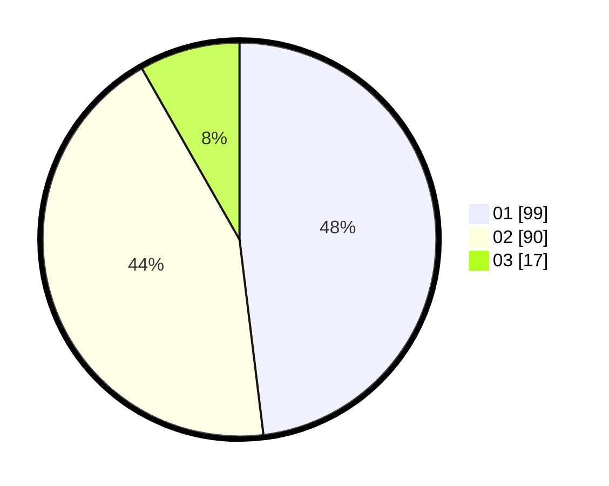

# Hasil

Hasil perolehan suara paslon dapat dilihat pada file paslon-01.txt, paslon-02.txt, dan paslon-03.txt.

Jika tidak ada, artinya data tersebut belum ada pada SIREKAP.

## Perolehan Suara

 * Paslon 01: **99**.
 * Paslon 02: **90**.
 * Paslon 03: **17**.

## Foto C Plano

https://sirekap-obj-formc.kpu.go.id/da52/pemilu/ppwp/31/75/06/10/03/3175061003255-20240215-130542--768237bb-9edc-42ad-9955-2d773a7a6b4e.jpg

https://sirekap-obj-formc.kpu.go.id/da52/pemilu/ppwp/31/75/06/10/03/3175061003255-20240214-195511--e7ea7164-b84d-48d1-8e6f-9e057fd318a8.jpg

https://sirekap-obj-formc.kpu.go.id/da52/pemilu/ppwp/31/75/06/10/03/3175061003255-20240214-195655--dee4181d-c50d-47df-b3a4-5fe439e4e480.jpg
