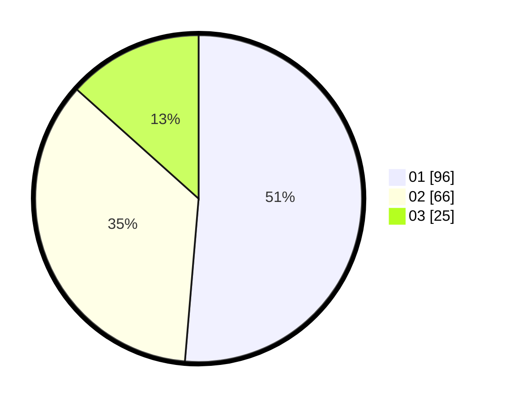

# Hasil

Hasil perolehan suara paslon dapat dilihat pada file paslon-01.txt, paslon-02.txt, dan paslon-03.txt.

Jika tidak ada, artinya data tersebut belum ada pada SIREKAP.

## Perolehan Suara

 * Paslon 01: **96**.
 * Paslon 02: **66**.
 * Paslon 03: **25**.

## Foto C Plano

https://sirekap-obj-formc.kpu.go.id/e8dd/pemilu/ppwp/31/75/06/10/03/3175061003268-20240214-210139--237f789b-7bea-4071-b2fe-d7e7d46b9996.jpg

https://sirekap-obj-formc.kpu.go.id/e8dd/pemilu/ppwp/31/75/06/10/03/3175061003268-20240214-210431--6932ae46-3843-41bc-90f6-828f0d512b08.jpg

https://sirekap-obj-formc.kpu.go.id/e8dd/pemilu/ppwp/31/75/06/10/03/3175061003268-20240214-210744--3320e8b3-0b70-4122-ad4f-e5a9b9323d55.jpg

## DATA PEMILIH TETAP

Jumlah pemilih dalam DPT: **252**.
 * L: **133**.
 * P: **119**.

## DATA PENGGUNA HAK PILIH

Jumlah pengguna hak pilih dalam DPT: **191**.
 * L: **100**.
 * P: **91**.

Jumlah pengguna hak pilih dalam DPTb: **0**.
 * L: **0**.
 * P: **0**.

Jumlah pengguna hak pilih dalam DPK: **0**.
 * L: **0**.
 * P: **0**.

Jumlah pengguna hak pilih: **191**.
 * L: **100**.
 * P: **91**.

## JUMLAH SUARA SAH DAN TIDAK SAH

JUMLAH SELURUH SUARA SAH: **187**.

JUMLAH SUARA TIDAK SAH: **4**.

JUMLAH SELURUH SUARA SAH DAN SUARA TIDAK SAH: **191**.
