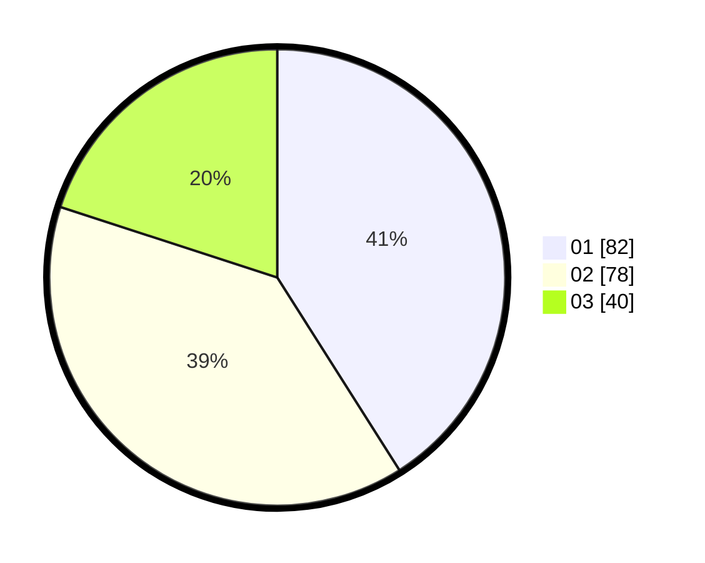

# Hasil

Hasil perolehan suara paslon dapat dilihat pada file paslon-01.txt, paslon-02.txt, dan paslon-03.txt.

Jika tidak ada, artinya data tersebut belum ada pada SIREKAP.

## Perolehan Suara

 * Paslon 01: **82**.
 * Paslon 02: **78**.
 * Paslon 03: **40**.

## Foto C Plano

https://sirekap-obj-formc.kpu.go.id/2ccc/pemilu/ppwp/31/75/06/10/03/3175061003270-20240216-072348--af776a99-a307-42e1-aaa3-48dcc92aebdb.jpg

https://sirekap-obj-formc.kpu.go.id/2ccc/pemilu/ppwp/31/75/06/10/03/3175061003270-20240216-072357--441e730c-6f84-4e97-9d0c-096783cc0b7e.jpg

https://sirekap-obj-formc.kpu.go.id/2ccc/pemilu/ppwp/31/75/06/10/03/3175061003270-20240214-184518--8d975ad5-bf47-4cef-ad87-a9aec4e3fa39.jpg

## DATA PEMILIH TETAP

Jumlah pemilih dalam DPT: **259**.
 * L: **136**.
 * P: **123**.

## DATA PENGGUNA HAK PILIH

Jumlah pengguna hak pilih dalam DPT: **198**.
 * L: **101**.
 * P: **97**.

Jumlah pengguna hak pilih dalam DPTb: **0**.
 * L: **0**.
 * P: **0**.

Jumlah pengguna hak pilih dalam DPK: **4**.
 * L: **2**.
 * P: **2**.

Jumlah pengguna hak pilih: **103**.
 * L: **202**.
 * P: **99**.

## JUMLAH SUARA SAH DAN TIDAK SAH

JUMLAH SELURUH SUARA SAH: **200**.

JUMLAH SUARA TIDAK SAH: **2**.

JUMLAH SELURUH SUARA SAH DAN SUARA TIDAK SAH: **202**.
