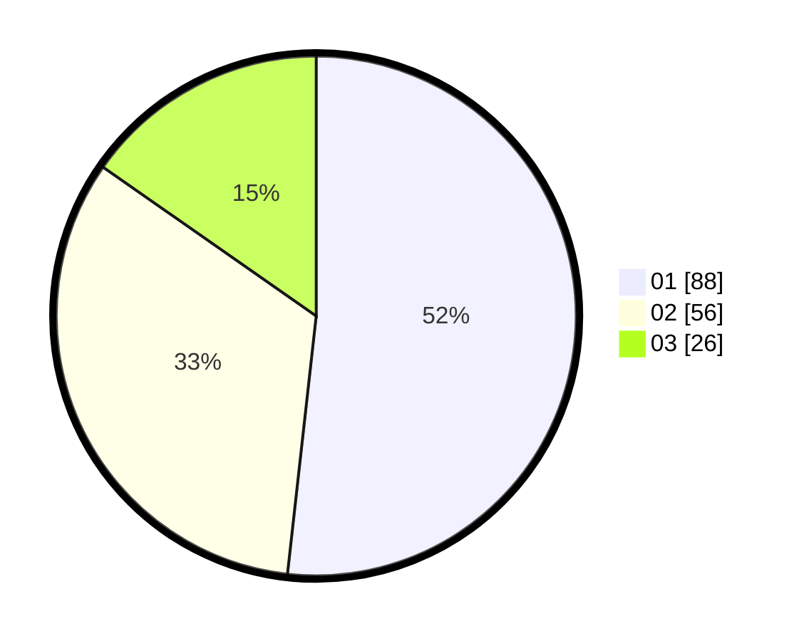

# Hasil

Hasil perolehan suara paslon dapat dilihat pada file paslon-01.txt, paslon-02.txt, dan paslon-03.txt.

Jika tidak ada, artinya data tersebut belum ada pada SIREKAP.

## Perolehan Suara

 * Paslon 01: **88**.
 * Paslon 02: **56**.
 * Paslon 03: **26**.

## Foto C Plano

https://sirekap-obj-formc.kpu.go.id/98f9/pemilu/ppwp/31/75/06/10/03/3175061003272-20240214-232805--efebd327-1b93-410c-a3e6-624b534dab96.jpg

https://sirekap-obj-formc.kpu.go.id/98f9/pemilu/ppwp/31/75/06/10/03/3175061003272-20240214-232815--16430491-263e-48bd-a75a-0b491398a954.jpg

https://sirekap-obj-formc.kpu.go.id/98f9/pemilu/ppwp/31/75/06/10/03/3175061003272-20240215-053742--1ebe5a94-d1c5-4a82-ae4c-fffa452c1636.jpg

## DATA PEMILIH TETAP

Jumlah pemilih dalam DPT: **220**.
 * L: **103**.
 * P: **117**.

## DATA PENGGUNA HAK PILIH

Jumlah pengguna hak pilih dalam DPT: **168**.
 * L: **77**.
 * P: **91**.

Jumlah pengguna hak pilih dalam DPTb: **0**.
 * L: **0**.
 * P: **0**.

Jumlah pengguna hak pilih dalam DPK: **5**.
 * L: **1**.
 * P: **4**.

Jumlah pengguna hak pilih: **173**.
 * L: **78**.
 * P: **95**.

## JUMLAH SUARA SAH DAN TIDAK SAH

JUMLAH SELURUH SUARA SAH: **170**.

JUMLAH SUARA TIDAK SAH: **3**.

JUMLAH SELURUH SUARA SAH DAN SUARA TIDAK SAH: **173**.
