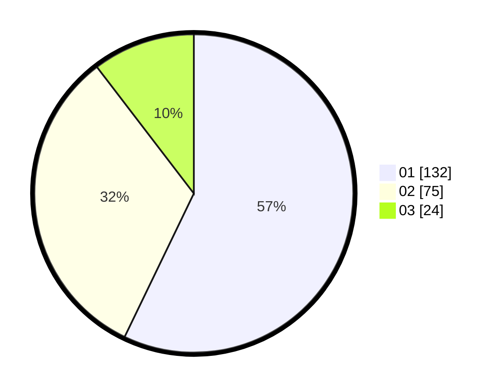

# Hasil

Hasil perolehan suara paslon dapat dilihat pada file paslon-01.txt, paslon-02.txt, dan paslon-03.txt.

Jika tidak ada, artinya data tersebut belum ada pada SIREKAP.

## Perolehan Suara

 * Paslon 01: **132**.
 * Paslon 02: **75**.
 * Paslon 03: **24**.

## Foto C Plano

https://sirekap-obj-formc.kpu.go.id/cf05/pemilu/ppwp/31/75/06/10/03/3175061003273-20240216-021204--55ae2599-8ab2-4929-9e10-71cd210a9b09.jpg

https://sirekap-obj-formc.kpu.go.id/cf05/pemilu/ppwp/31/75/06/10/03/3175061003273-20240216-021205--98ddb2a2-1f51-4204-b132-02a699b159cf.jpg

https://sirekap-obj-formc.kpu.go.id/cf05/pemilu/ppwp/31/75/06/10/03/3175061003273-20240216-021204--c47d9d2d-eb1b-45f3-806e-bee2c191cf3f.jpg

## DATA PEMILIH TETAP

Jumlah pemilih dalam DPT: **279**.
 * L: **138**.
 * P: **141**.

## DATA PENGGUNA HAK PILIH

Jumlah pengguna hak pilih dalam DPT: **228**.
 * L: **111**.
 * P: **117**.

Jumlah pengguna hak pilih dalam DPTb: **2**.
 * L: **1**.
 * P: **1**.

Jumlah pengguna hak pilih dalam DPK: **1**.
 * L: **0**.
 * P: **1**.

Jumlah pengguna hak pilih: **231**.
 * L: **112**.
 * P: **119**.

## JUMLAH SUARA SAH DAN TIDAK SAH

JUMLAH SELURUH SUARA SAH: **231**.

JUMLAH SUARA TIDAK SAH: **0**.

JUMLAH SELURUH SUARA SAH DAN SUARA TIDAK SAH: **231**.
