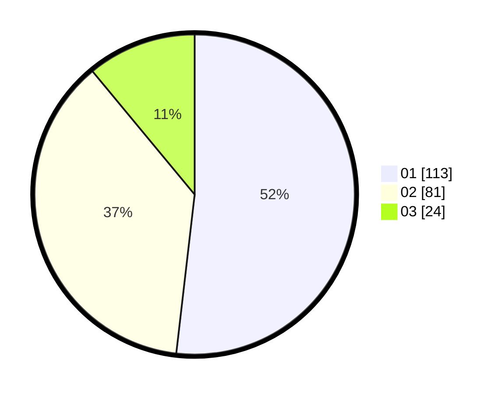

# Hasil

Hasil perolehan suara paslon dapat dilihat pada file paslon-01.txt, paslon-02.txt, dan paslon-03.txt.

Jika tidak ada, artinya data tersebut belum ada pada SIREKAP.

## Perolehan Suara

 * Paslon 01: **113**.
 * Paslon 02: **81**.
 * Paslon 03: **24**.

## Foto C Plano

https://sirekap-obj-formc.kpu.go.id/86d5/pemilu/ppwp/31/75/06/10/03/3175061003274-20240214-225141--16855a0a-1a80-4e57-a2bb-12b2fbc7abee.jpg

https://sirekap-obj-formc.kpu.go.id/86d5/pemilu/ppwp/31/75/06/10/03/3175061003274-20240214-210803--923a2bc6-c55b-46c1-9350-98eea1cf2bb4.jpg

https://sirekap-obj-formc.kpu.go.id/86d5/pemilu/ppwp/31/75/06/10/03/3175061003274-20240214-225350--77bb1e1c-a3a2-4800-b944-007b271ffb99.jpg

## DATA PEMILIH TETAP

Jumlah pemilih dalam DPT: **274**.
 * L: **141**.
 * P: **133**.

## DATA PENGGUNA HAK PILIH

Jumlah pengguna hak pilih dalam DPT: **213**.
 * L: **108**.
 * P: **105**.

Jumlah pengguna hak pilih dalam DPTb: **0**.
 * L: **0**.
 * P: **0**.

Jumlah pengguna hak pilih dalam DPK: **7**.
 * L: **2**.
 * P: **5**.

Jumlah pengguna hak pilih: **220**.
 * L: **110**.
 * P: **110**.

## JUMLAH SUARA SAH DAN TIDAK SAH

JUMLAH SELURUH SUARA SAH: **218**.

JUMLAH SUARA TIDAK SAH: **2**.

JUMLAH SELURUH SUARA SAH DAN SUARA TIDAK SAH: **220**.
