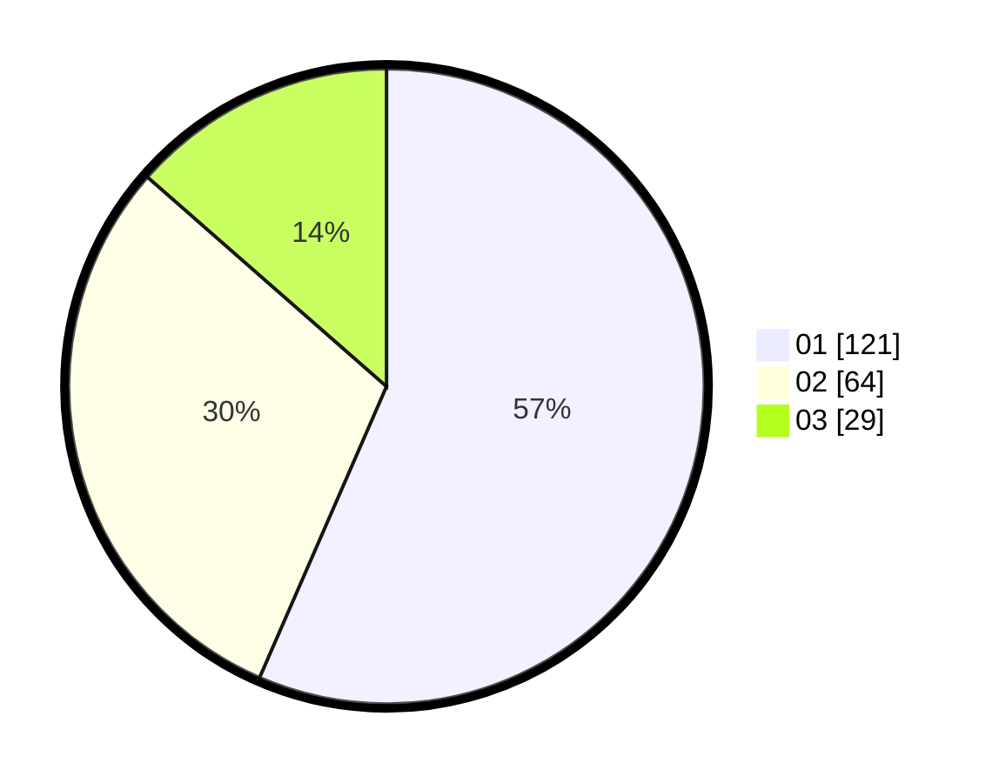

# Hasil

Hasil perolehan suara paslon dapat dilihat pada file paslon-01.txt, paslon-02.txt, dan paslon-03.txt.

Jika tidak ada, artinya data tersebut belum ada pada SIREKAP.

## Perolehan Suara

 * Paslon 01: **121**.
 * Paslon 02: **64**.
 * Paslon 03: **29**.

## Foto C Plano

https://sirekap-obj-formc.kpu.go.id/1683/pemilu/ppwp/31/75/06/10/03/3175061003277-20240216-175940--a29c4dfc-01c6-44ca-ac63-0683894feee3.jpg

https://sirekap-obj-formc.kpu.go.id/1683/pemilu/ppwp/31/75/06/10/03/3175061003277-20240216-231541--096c2d04-56d1-437f-a7ff-805292200b1e.jpg

https://sirekap-obj-formc.kpu.go.id/1683/pemilu/ppwp/31/75/06/10/03/3175061003277-20240216-181740--2c2f7d04-e819-4a99-acc8-6320c29eb824.jpg

## DATA PEMILIH TETAP

Jumlah pemilih dalam DPT: **277**.
 * L: **133**.
 * P: **144**.

## DATA PENGGUNA HAK PILIH

Jumlah pengguna hak pilih dalam DPT: **217**.
 * L: **102**.
 * P: **115**.

Jumlah pengguna hak pilih dalam DPTb: **1**.
 * L: **1**.
 * P: **0**.

Jumlah pengguna hak pilih dalam DPK: **0**.
 * L: **0**.
 * P: **0**.

Jumlah pengguna hak pilih: **218**.
 * L: **103**.
 * P: **115**.

## JUMLAH SUARA SAH DAN TIDAK SAH

JUMLAH SELURUH SUARA SAH: **214**.

JUMLAH SUARA TIDAK SAH: **4**.

JUMLAH SELURUH SUARA SAH DAN SUARA TIDAK SAH: **218**.
