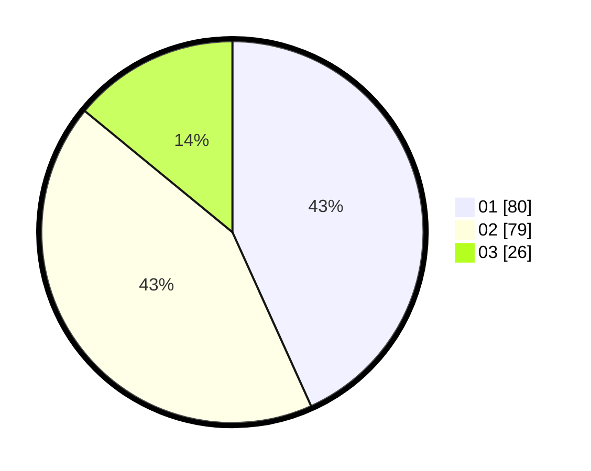

# Hasil

Hasil perolehan suara paslon dapat dilihat pada file paslon-01.txt, paslon-02.txt, dan paslon-03.txt.

Jika tidak ada, artinya data tersebut belum ada pada SIREKAP.

## Perolehan Suara

 * Paslon 01: **80**.
 * Paslon 02: **79**.
 * Paslon 03: **26**.

## Foto C Plano

https://sirekap-obj-formc.kpu.go.id/4531/pemilu/ppwp/31/75/06/10/03/3175061003279-20240216-080143--7a59b33c-675f-43da-a3ab-1e0c7dedcf65.jpg

https://sirekap-obj-formc.kpu.go.id/4531/pemilu/ppwp/31/75/06/10/03/3175061003279-20240216-090129--357ad367-5339-456f-8340-b4fe1ac66b01.jpg

https://sirekap-obj-formc.kpu.go.id/4531/pemilu/ppwp/31/75/06/10/03/3175061003279-20240216-090128--a4abc386-7871-44b3-8748-7dabc5ab3ec7.jpg

## DATA PEMILIH TETAP

Jumlah pemilih dalam DPT: **245**.
 * L: **123**.
 * P: **122**.

## DATA PENGGUNA HAK PILIH

Jumlah pengguna hak pilih dalam DPT: **186**.
 * L: **89**.
 * P: **97**.

Jumlah pengguna hak pilih dalam DPTb: **1**.
 * L: **1**.
 * P: **0**.

Jumlah pengguna hak pilih dalam DPK: **0**.
 * L: **0**.
 * P: **0**.

Jumlah pengguna hak pilih: **187**.
 * L: **90**.
 * P: **97**.

## JUMLAH SUARA SAH DAN TIDAK SAH

JUMLAH SELURUH SUARA SAH: **185**.

JUMLAH SUARA TIDAK SAH: **2**.

JUMLAH SELURUH SUARA SAH DAN SUARA TIDAK SAH: **187**.
