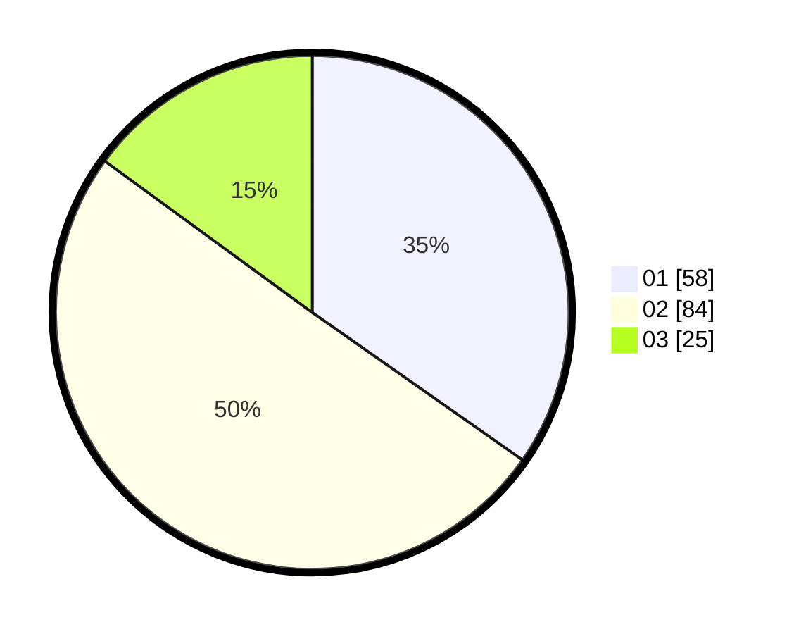

# Hasil

Hasil perolehan suara paslon dapat dilihat pada file paslon-01.txt, paslon-02.txt, dan paslon-03.txt.

Jika tidak ada, artinya data tersebut belum ada pada SIREKAP.

## Perolehan Suara

 * Paslon 01: **58**.
 * Paslon 02: **84**.
 * Paslon 03: **25**.

## Foto C Plano

https://sirekap-obj-formc.kpu.go.id/cda4/pemilu/ppwp/31/75/06/10/03/3175061003280-20240214-155320--39a89d26-ed22-4e18-bec4-e3609c5ab979.jpg

https://sirekap-obj-formc.kpu.go.id/cda4/pemilu/ppwp/31/75/06/10/03/3175061003280-20240214-155716--1fdcd251-0bd3-4226-aeaa-cdd7bbdebdc9.jpg

https://sirekap-obj-formc.kpu.go.id/cda4/pemilu/ppwp/31/75/06/10/03/3175061003280-20240214-160104--da4f6ed1-aaf3-463e-bcbb-d765b34c4811.jpg

## DATA PEMILIH TETAP

Jumlah pemilih dalam DPT: **234**.
 * L: **127**.
 * P: **107**.

## DATA PENGGUNA HAK PILIH

Jumlah pengguna hak pilih dalam DPT: **171**.
 * L: **91**.
 * P: **80**.

Jumlah pengguna hak pilih dalam DPTb: **0**.
 * L: **0**.
 * P: **0**.

Jumlah pengguna hak pilih dalam DPK: **0**.
 * L: **0**.
 * P: **0**.

Jumlah pengguna hak pilih: **171**.
 * L: **91**.
 * P: **80**.

## JUMLAH SUARA SAH DAN TIDAK SAH

JUMLAH SELURUH SUARA SAH: **167**.

JUMLAH SUARA TIDAK SAH: **4**.

JUMLAH SELURUH SUARA SAH DAN SUARA TIDAK SAH: **171**.
