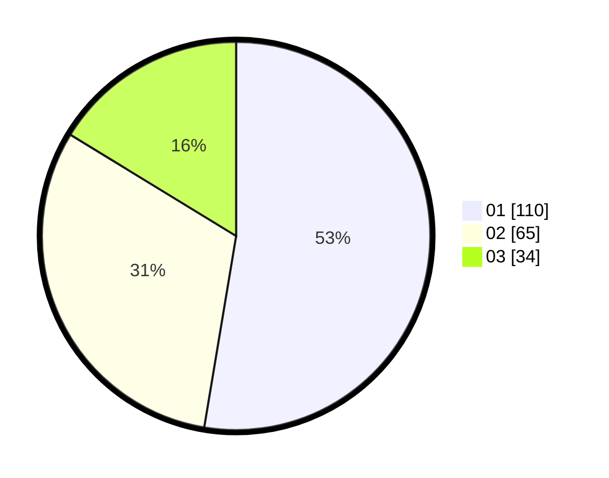

# Hasil

Hasil perolehan suara paslon dapat dilihat pada file paslon-01.txt, paslon-02.txt, dan paslon-03.txt.

Jika tidak ada, artinya data tersebut belum ada pada SIREKAP.

## Perolehan Suara

 * Paslon 01: **110**.
 * Paslon 02: **65**.
 * Paslon 03: **34**.

## Foto C Plano

https://sirekap-obj-formc.kpu.go.id/bd21/pemilu/ppwp/31/75/06/10/03/3175061003287-20240216-131955--6945e1f6-b96b-44e0-9ad5-8458f0df0a26.jpg

https://sirekap-obj-formc.kpu.go.id/bd21/pemilu/ppwp/31/75/06/10/03/3175061003287-20240216-131956--03bc2ff9-c32a-45da-966f-25a346da0ead.jpg

https://sirekap-obj-formc.kpu.go.id/bd21/pemilu/ppwp/31/75/06/10/03/3175061003287-20240216-131955--64079017-e8af-46e6-94fc-a213e9509896.jpg

## DATA PEMILIH TETAP

Jumlah pemilih dalam DPT: **257**.
 * L: **125**.
 * P: **132**.

## DATA PENGGUNA HAK PILIH

Jumlah pengguna hak pilih dalam DPT: **203**.
 * L: **98**.
 * P: **105**.

Jumlah pengguna hak pilih dalam DPTb: **6**.
 * L: **4**.
 * P: **2**.

Jumlah pengguna hak pilih dalam DPK: **4**.
 * L: **2**.
 * P: **2**.

Jumlah pengguna hak pilih: **213**.
 * L: **104**.
 * P: **109**.

## JUMLAH SUARA SAH DAN TIDAK SAH

JUMLAH SELURUH SUARA SAH: **209**.

JUMLAH SUARA TIDAK SAH: **4**.

JUMLAH SELURUH SUARA SAH DAN SUARA TIDAK SAH: **213**.
