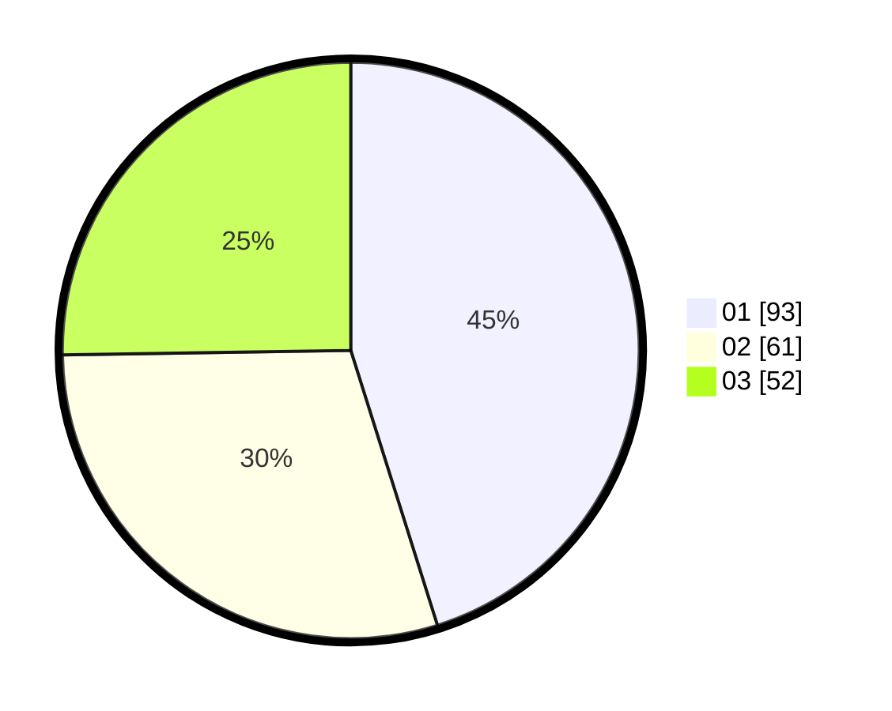

# Hasil

Hasil perolehan suara paslon dapat dilihat pada file paslon-01.txt, paslon-02.txt, dan paslon-03.txt.

Jika tidak ada, artinya data tersebut belum ada pada SIREKAP.

## Perolehan Suara

 * Paslon 01: **93**.
 * Paslon 02: **61**.
 * Paslon 03: **52**.

## Foto C Plano

https://sirekap-obj-formc.kpu.go.id/6db6/pemilu/ppwp/31/75/06/10/03/3175061003288-20240216-093900--af99eafc-8bdc-4bc2-99f9-90d45383559e.jpg

https://sirekap-obj-formc.kpu.go.id/6db6/pemilu/ppwp/31/75/06/10/03/3175061003288-20240216-093901--1a99b54d-4250-46e4-8e46-ff4105b0fec0.jpg

https://sirekap-obj-formc.kpu.go.id/6db6/pemilu/ppwp/31/75/06/10/03/3175061003288-20240216-093900--cecafb46-5577-41af-adbb-e1de563e6b3d.jpg

## DATA PEMILIH TETAP

Jumlah pemilih dalam DPT: **238**.
 * L: **114**.
 * P: **124**.

## DATA PENGGUNA HAK PILIH

Jumlah pengguna hak pilih dalam DPT: **200**.
 * L: **91**.
 * P: **109**.

Jumlah pengguna hak pilih dalam DPTb: **6**.
 * L: **2**.
 * P: **4**.

Jumlah pengguna hak pilih dalam DPK: **2**.
 * L: **2**.
 * P: **0**.

Jumlah pengguna hak pilih: **208**.
 * L: **95**.
 * P: **113**.

## JUMLAH SUARA SAH DAN TIDAK SAH

JUMLAH SELURUH SUARA SAH: **206**.

JUMLAH SUARA TIDAK SAH: **2**.

JUMLAH SELURUH SUARA SAH DAN SUARA TIDAK SAH: **208**.
