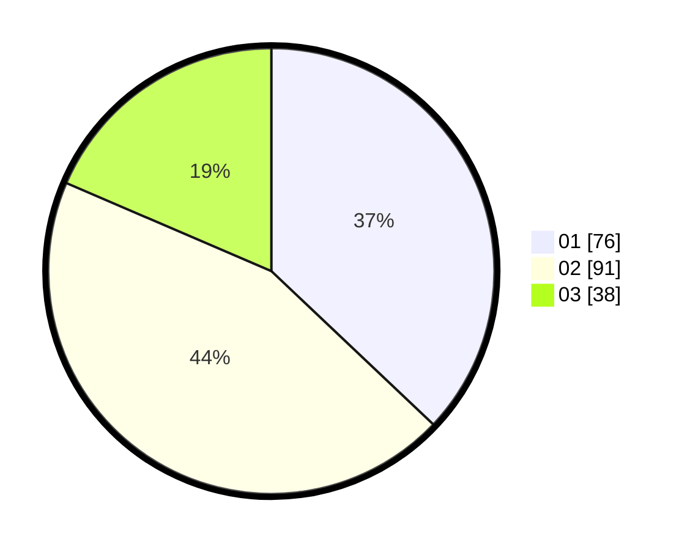

# Hasil

Hasil perolehan suara paslon dapat dilihat pada file paslon-01.txt, paslon-02.txt, dan paslon-03.txt.

Jika tidak ada, artinya data tersebut belum ada pada SIREKAP.

## Perolehan Suara

 * Paslon 01: **76**.
 * Paslon 02: **91**.
 * Paslon 03: **38**.

## Foto C Plano

https://sirekap-obj-formc.kpu.go.id/c83b/pemilu/ppwp/31/75/06/10/03/3175061003292-20240216-011451--2c9db688-9dc1-4fd5-a1ef-74fdac378efa.jpg

https://sirekap-obj-formc.kpu.go.id/c83b/pemilu/ppwp/31/75/06/10/03/3175061003292-20240216-013352--a1ed72fc-7598-46e5-a5cd-8cb7d6c237c6.jpg

https://sirekap-obj-formc.kpu.go.id/c83b/pemilu/ppwp/31/75/06/10/03/3175061003292-20240216-013352--3275d337-0c22-48b2-a7b0-b6383ba25949.jpg

## DATA PEMILIH TETAP

Jumlah pemilih dalam DPT: **290**.
 * L: **148**.
 * P: **142**.

## DATA PENGGUNA HAK PILIH

Jumlah pengguna hak pilih dalam DPT: **207**.
 * L: **101**.
 * P: **106**.

Jumlah pengguna hak pilih dalam DPTb: **1**.
 * L: **1**.
 * P: **0**.

Jumlah pengguna hak pilih dalam DPK: **0**.
 * L: **0**.
 * P: **0**.

Jumlah pengguna hak pilih: **208**.
 * L: **102**.
 * P: **106**.

## JUMLAH SUARA SAH DAN TIDAK SAH

JUMLAH SELURUH SUARA SAH: **205**.

JUMLAH SUARA TIDAK SAH: **3**.

JUMLAH SELURUH SUARA SAH DAN SUARA TIDAK SAH: **208**.
