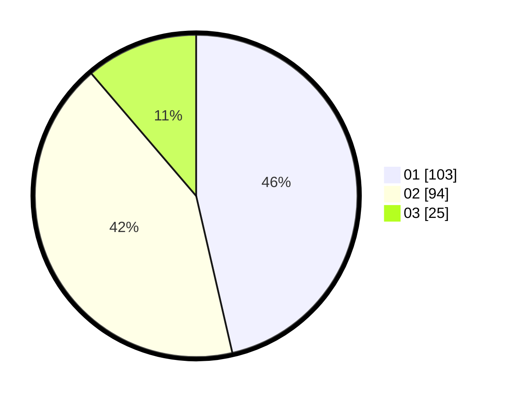

# Hasil

Hasil perolehan suara paslon dapat dilihat pada file paslon-01.txt, paslon-02.txt, dan paslon-03.txt.

Jika tidak ada, artinya data tersebut belum ada pada SIREKAP.

## Perolehan Suara

 * Paslon 01: **103**.
 * Paslon 02: **94**.
 * Paslon 03: **25**.

## Foto C Plano

https://sirekap-obj-formc.kpu.go.id/5072/pemilu/ppwp/31/75/06/10/03/3175061003294-20240214-235734--562ec869-a8b3-4352-94cf-7af5fafbcd5f.jpg

https://sirekap-obj-formc.kpu.go.id/5072/pemilu/ppwp/31/75/06/10/03/3175061003294-20240214-235919--46cc713a-b55c-46a1-9f30-95cc2f2afdfe.jpg

https://sirekap-obj-formc.kpu.go.id/5072/pemilu/ppwp/31/75/06/10/03/3175061003294-20240214-221401--6dc14e97-30cf-4e77-a242-c209b3987d30.jpg
