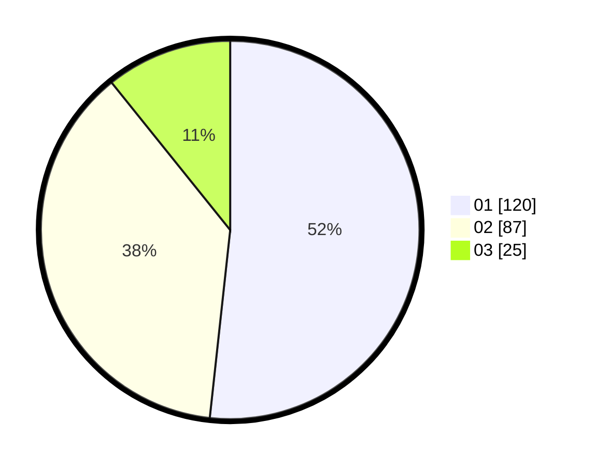

# Hasil

Hasil perolehan suara paslon dapat dilihat pada file paslon-01.txt, paslon-02.txt, dan paslon-03.txt.

Jika tidak ada, artinya data tersebut belum ada pada SIREKAP.

## Perolehan Suara

 * Paslon 01: **120**.
 * Paslon 02: **87**.
 * Paslon 03: **25**.

## Foto C Plano

https://sirekap-obj-formc.kpu.go.id/8354/pemilu/ppwp/31/75/06/10/03/3175061003295-20240214-231736--4f0b5065-0d80-4fca-88e9-85f5992b5f7b.jpg

https://sirekap-obj-formc.kpu.go.id/8354/pemilu/ppwp/31/75/06/10/03/3175061003295-20240214-231903--c09a2372-44ee-421a-9f60-e511756db5a8.jpg

https://sirekap-obj-formc.kpu.go.id/8354/pemilu/ppwp/31/75/06/10/03/3175061003295-20240214-233040--58aac9ff-f38d-42fd-a434-39ec2f9238f5.jpg
