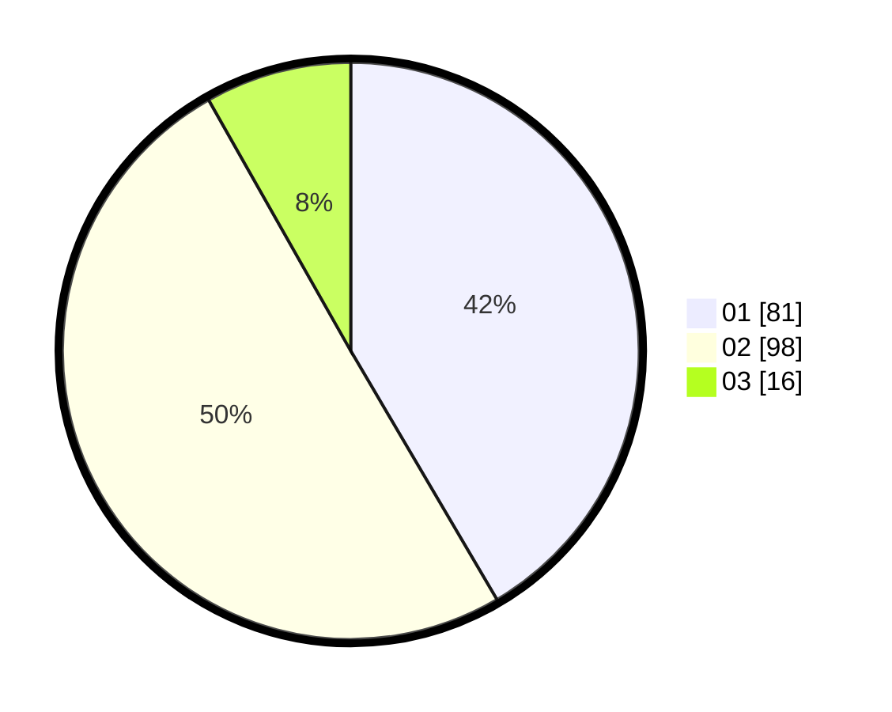

# Hasil

Hasil perolehan suara paslon dapat dilihat pada file paslon-01.txt, paslon-02.txt, dan paslon-03.txt.

Jika tidak ada, artinya data tersebut belum ada pada SIREKAP.

## Perolehan Suara

 * Paslon 01: **81**.
 * Paslon 02: **98**.
 * Paslon 03: **16**.

## Foto C Plano

https://sirekap-obj-formc.kpu.go.id/fa1d/pemilu/ppwp/31/75/06/10/03/3175061003300-20240215-002159--c608c290-7a78-4a65-9468-39a1269c8ef2.jpg

https://sirekap-obj-formc.kpu.go.id/fa1d/pemilu/ppwp/31/75/06/10/03/3175061003300-20240215-002249--62fe928e-acf4-4b7e-b409-037863555345.jpg

https://sirekap-obj-formc.kpu.go.id/fa1d/pemilu/ppwp/31/75/06/10/03/3175061003300-20240215-014955--f985bcd2-fd96-4739-9d4e-87c16bd397c9.jpg
