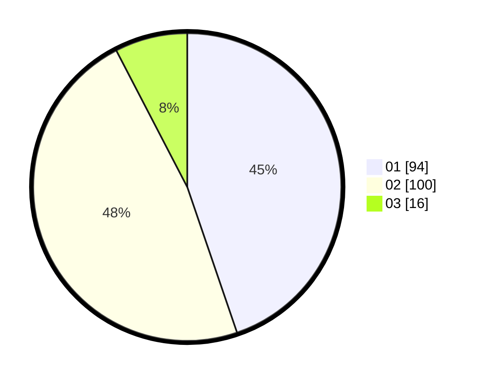

# Hasil

Hasil perolehan suara paslon dapat dilihat pada file paslon-01.txt, paslon-02.txt, dan paslon-03.txt.

Jika tidak ada, artinya data tersebut belum ada pada SIREKAP.

## Perolehan Suara

 * Paslon 01: **94**.
 * Paslon 02: **100**.
 * Paslon 03: **16**.

## Foto C Plano

https://sirekap-obj-formc.kpu.go.id/ee9e/pemilu/ppwp/31/75/06/10/03/3175061003301-20240216-010936--86209a32-25ea-48b8-87c1-1901f9943821.jpg

https://sirekap-obj-formc.kpu.go.id/ee9e/pemilu/ppwp/31/75/06/10/03/3175061003301-20240216-010938--d8e6a3fb-22bf-4a34-a559-eb75f8c9d8e4.jpg

https://sirekap-obj-formc.kpu.go.id/ee9e/pemilu/ppwp/31/75/06/10/03/3175061003301-20240216-010937--302dde84-6756-4249-b55c-756c33f1bd80.jpg

## DATA PEMILIH TETAP

Jumlah pemilih dalam DPT: **265**.
 * L: **132**.
 * P: **133**.

## DATA PENGGUNA HAK PILIH

Jumlah pengguna hak pilih dalam DPT: **210**.
 * L: **100**.
 * P: **110**.

Jumlah pengguna hak pilih dalam DPTb: **5**.
 * L: **3**.
 * P: **2**.

Jumlah pengguna hak pilih dalam DPK: **0**.
 * L: **0**.
 * P: **0**.

Jumlah pengguna hak pilih: **215**.
 * L: **103**.
 * P: **112**.

## JUMLAH SUARA SAH DAN TIDAK SAH

JUMLAH SELURUH SUARA SAH: **210**.

JUMLAH SUARA TIDAK SAH: **5**.

JUMLAH SELURUH SUARA SAH DAN SUARA TIDAK SAH: **215**.
