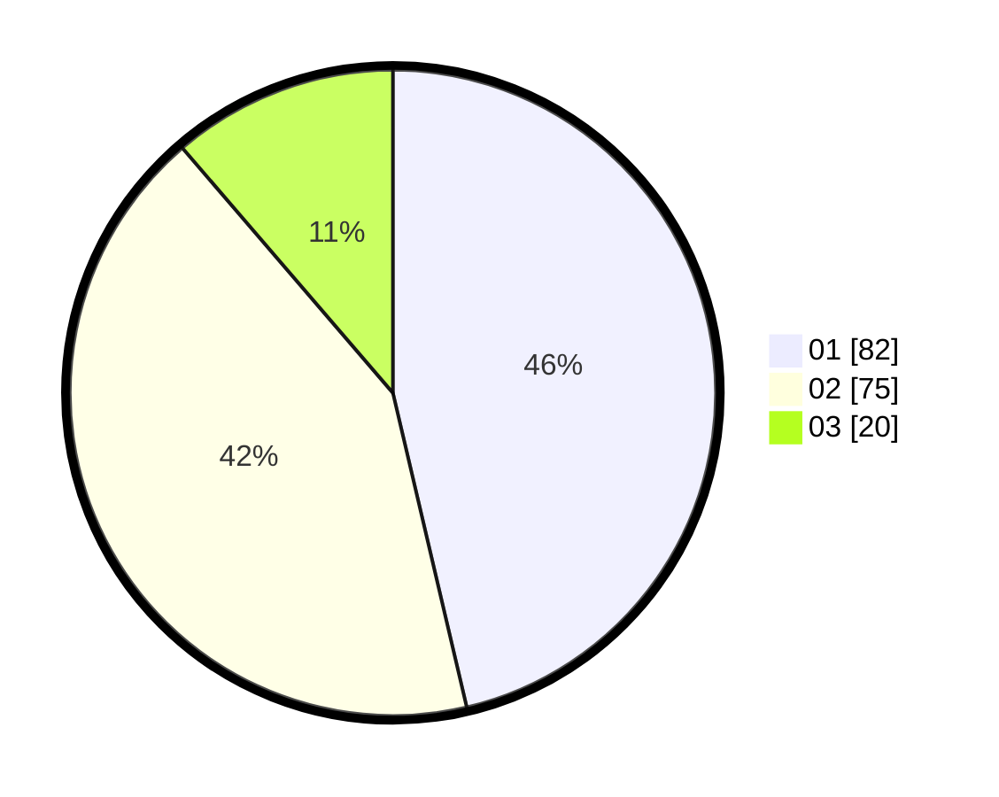

# Hasil

Hasil perolehan suara paslon dapat dilihat pada file paslon-01.txt, paslon-02.txt, dan paslon-03.txt.

Jika tidak ada, artinya data tersebut belum ada pada SIREKAP.

## Perolehan Suara

 * Paslon 01: **82**.
 * Paslon 02: **75**.
 * Paslon 03: **20**.

## Foto C Plano

https://sirekap-obj-formc.kpu.go.id/fc5f/pemilu/ppwp/31/75/06/10/03/3175061003305-20240214-205721--c91feed6-c836-42ac-8218-305ef63f235c.jpg

https://sirekap-obj-formc.kpu.go.id/fc5f/pemilu/ppwp/31/75/06/10/03/3175061003305-20240216-000850--531437a7-519e-486b-983b-1f72eae077f2.jpg

https://sirekap-obj-formc.kpu.go.id/fc5f/pemilu/ppwp/31/75/06/10/03/3175061003305-20240214-205849--aa1f6bcd-1fbe-4536-bcce-2336b8b38c57.jpg

## DATA PEMILIH TETAP

Jumlah pemilih dalam DPT: **212**.
 * L: **114**.
 * P: **98**.

## DATA PENGGUNA HAK PILIH

Jumlah pengguna hak pilih dalam DPT: **177**.
 * L: **94**.
 * P: **83**.

Jumlah pengguna hak pilih dalam DPTb: **0**.
 * L: **0**.
 * P: **0**.

Jumlah pengguna hak pilih dalam DPK: **0**.
 * L: **0**.
 * P: **0**.

Jumlah pengguna hak pilih: **177**.
 * L: **94**.
 * P: **83**.

## JUMLAH SUARA SAH DAN TIDAK SAH

JUMLAH SELURUH SUARA SAH: **177**.

JUMLAH SUARA TIDAK SAH: **0**.

JUMLAH SELURUH SUARA SAH DAN SUARA TIDAK SAH: **177**.
