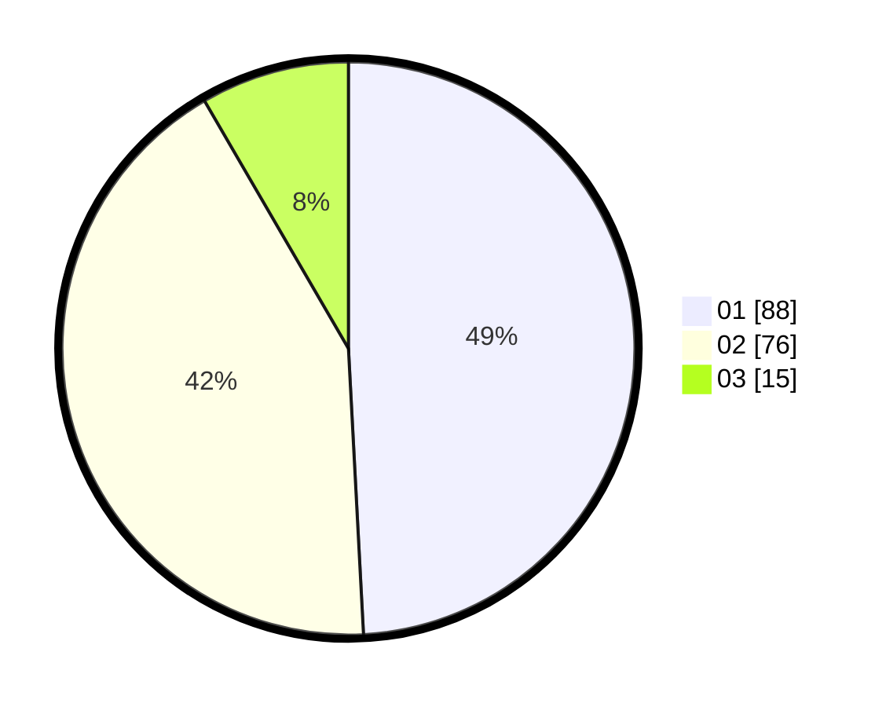

# Hasil

Hasil perolehan suara paslon dapat dilihat pada file paslon-01.txt, paslon-02.txt, dan paslon-03.txt.

Jika tidak ada, artinya data tersebut belum ada pada SIREKAP.

## Perolehan Suara

 * Paslon 01: **88**.
 * Paslon 02: **76**.
 * Paslon 03: **15**.

## Foto C Plano

https://sirekap-obj-formc.kpu.go.id/e749/pemilu/ppwp/31/75/06/10/03/3175061003306-20240216-134120--dc7a8773-ebe4-488b-9265-24a2cbec948d.jpg

https://sirekap-obj-formc.kpu.go.id/e749/pemilu/ppwp/31/75/06/10/03/3175061003306-20240216-134121--3774d104-0c96-4da2-92ef-554aa32b2e41.jpg

https://sirekap-obj-formc.kpu.go.id/e749/pemilu/ppwp/31/75/06/10/03/3175061003306-20240216-134121--f15827b1-a752-486a-8d3f-2a1d8d485775.jpg

## DATA PEMILIH TETAP

Jumlah pemilih dalam DPT: **228**.
 * L: **117**.
 * P: **111**.

## DATA PENGGUNA HAK PILIH

Jumlah pengguna hak pilih dalam DPT: **177**.
 * L: **87**.
 * P: **90**.

Jumlah pengguna hak pilih dalam DPTb: **0**.
 * L: **0**.
 * P: **0**.

Jumlah pengguna hak pilih dalam DPK: **8**.
 * L: **2**.
 * P: **6**.

Jumlah pengguna hak pilih: **185**.
 * L: **89**.
 * P: **96**.

## JUMLAH SUARA SAH DAN TIDAK SAH

JUMLAH SELURUH SUARA SAH: **179**.

JUMLAH SUARA TIDAK SAH: **6**.

JUMLAH SELURUH SUARA SAH DAN SUARA TIDAK SAH: **185**.
