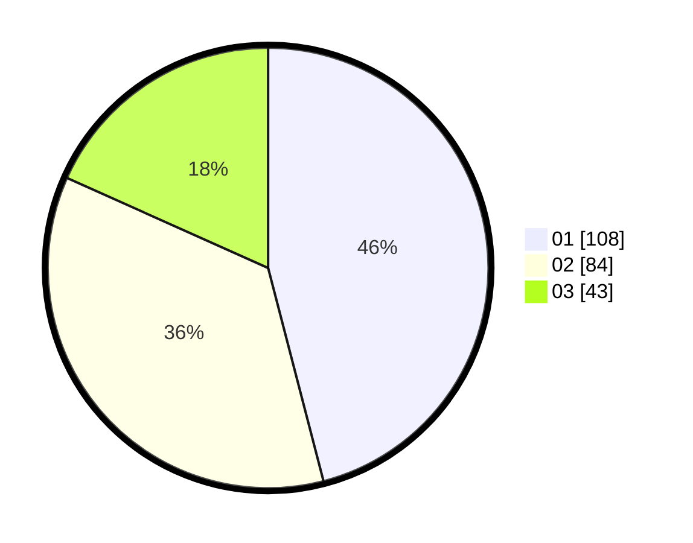

# Hasil

Hasil perolehan suara paslon dapat dilihat pada file paslon-01.txt, paslon-02.txt, dan paslon-03.txt.

Jika tidak ada, artinya data tersebut belum ada pada SIREKAP.

## Perolehan Suara

 * Paslon 01: **108**.
 * Paslon 02: **84**.
 * Paslon 03: **43**.

## Foto C Plano

https://sirekap-obj-formc.kpu.go.id/77d5/pemilu/ppwp/31/75/06/10/03/3175061003313-20240214-235318--040f3dd1-9e5b-4f3e-8a86-373138582b3c.jpg

https://sirekap-obj-formc.kpu.go.id/77d5/pemilu/ppwp/31/75/06/10/03/3175061003313-20240214-235344--8b1cc5d8-6605-44c7-8b00-f803e3e2519d.jpg

https://sirekap-obj-formc.kpu.go.id/77d5/pemilu/ppwp/31/75/06/10/03/3175061003313-20240214-235437--ee6bfd4d-3cab-4966-a892-fa2b0412a6b5.jpg
