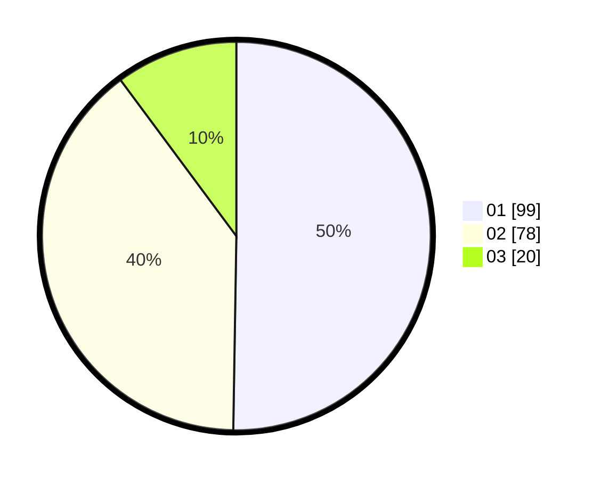

# Hasil

Hasil perolehan suara paslon dapat dilihat pada file paslon-01.txt, paslon-02.txt, dan paslon-03.txt.

Jika tidak ada, artinya data tersebut belum ada pada SIREKAP.

## Perolehan Suara

 * Paslon 01: **99**.
 * Paslon 02: **78**.
 * Paslon 03: **20**.

## Foto C Plano

https://sirekap-obj-formc.kpu.go.id/df93/pemilu/ppwp/31/75/06/10/03/3175061003323-20240215-012753--664d1756-4e8c-40e9-b12b-7071f3e6d1e7.jpg

https://sirekap-obj-formc.kpu.go.id/df93/pemilu/ppwp/31/75/06/10/03/3175061003323-20240215-012851--c09dc103-f64b-468b-b77d-58e79e6e7df7.jpg

https://sirekap-obj-formc.kpu.go.id/df93/pemilu/ppwp/31/75/06/10/03/3175061003323-20240215-012953--8cdcc778-fa91-44cb-85b3-6285d35c891d.jpg
