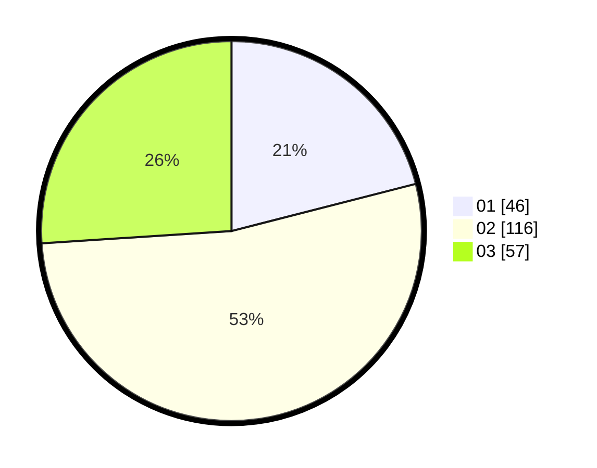

# Hasil

Hasil perolehan suara paslon dapat dilihat pada file paslon-01.txt, paslon-02.txt, dan paslon-03.txt.

Jika tidak ada, artinya data tersebut belum ada pada SIREKAP.

## Perolehan Suara

 * Paslon 01: **46**.
 * Paslon 02: **116**.
 * Paslon 03: **57**.

## Foto C Plano

https://sirekap-obj-formc.kpu.go.id/2c28/pemilu/ppwp/31/75/06/10/03/3175061003332-20240216-145650--a023d512-734e-4072-ab47-abd781dafec5.jpg

https://sirekap-obj-formc.kpu.go.id/2c28/pemilu/ppwp/31/75/06/10/03/3175061003332-20240216-145651--7801e87b-ca9e-4b04-ab57-86450e8b9b5e.jpg

https://sirekap-obj-formc.kpu.go.id/2c28/pemilu/ppwp/31/75/06/10/03/3175061003332-20240216-145651--b3fe658d-5ea2-4fde-8824-bb8f26bef8c1.jpg

## DATA PEMILIH TETAP

Jumlah pemilih dalam DPT: **273**.
 * L: **140**.
 * P: **133**.

## DATA PENGGUNA HAK PILIH

Jumlah pengguna hak pilih dalam DPT: **224**.
 * L: **114**.
 * P: **110**.

Jumlah pengguna hak pilih dalam DPTb: **0**.
 * L: **0**.
 * P: **0**.

Jumlah pengguna hak pilih dalam DPK: **3**.
 * L: **2**.
 * P: **1**.

Jumlah pengguna hak pilih: **227**.
 * L: **116**.
 * P: **111**.

## JUMLAH SUARA SAH DAN TIDAK SAH

JUMLAH SELURUH SUARA SAH: **219**.

JUMLAH SUARA TIDAK SAH: **5**.

JUMLAH SELURUH SUARA SAH DAN SUARA TIDAK SAH: **224**.
