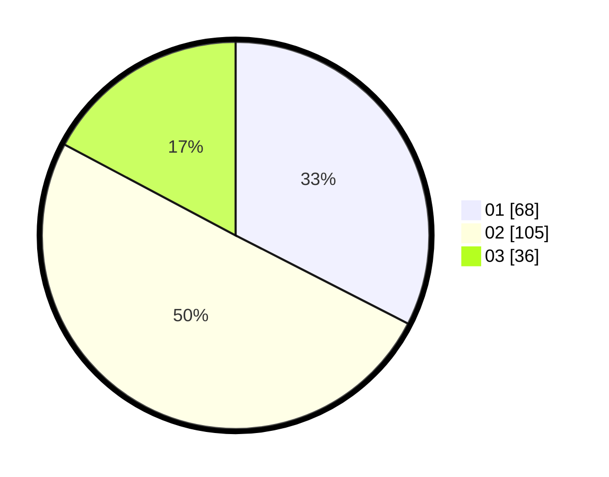

# Hasil

Hasil perolehan suara paslon dapat dilihat pada file paslon-01.txt, paslon-02.txt, dan paslon-03.txt.

Jika tidak ada, artinya data tersebut belum ada pada SIREKAP.

## Perolehan Suara

 * Paslon 01: **68**.
 * Paslon 02: **105**.
 * Paslon 03: **36**.

## Foto C Plano

https://sirekap-obj-formc.kpu.go.id/d737/pemilu/ppwp/31/75/06/10/03/3175061003333-20240214-195444--2f87a43e-63ca-430f-af6d-7173b2887619.jpg

https://sirekap-obj-formc.kpu.go.id/d737/pemilu/ppwp/31/75/06/10/03/3175061003333-20240214-195632--4495d5fb-a9f0-465a-bd39-7a9fee45177f.jpg

https://sirekap-obj-formc.kpu.go.id/d737/pemilu/ppwp/31/75/06/10/03/3175061003333-20240214-193921--beda6e35-4bfd-4cab-a223-02a73313bf06.jpg
