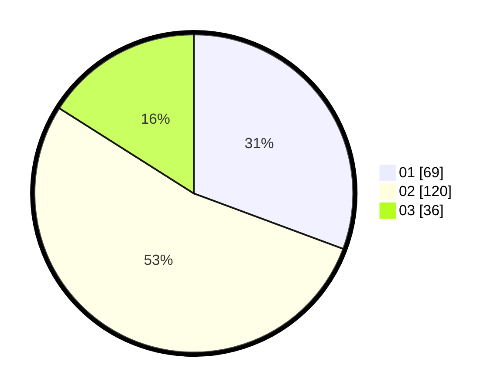

# Hasil

Hasil perolehan suara paslon dapat dilihat pada file paslon-01.txt, paslon-02.txt, dan paslon-03.txt.

Jika tidak ada, artinya data tersebut belum ada pada SIREKAP.

## Perolehan Suara

 * Paslon 01: **69**.
 * Paslon 02: **120**.
 * Paslon 03: **36**.

## Foto C Plano

https://sirekap-obj-formc.kpu.go.id/c2b5/pemilu/ppwp/31/75/06/10/03/3175061003341-20240215-234949--33893f24-2beb-4384-83d4-c1c48530e143.jpg

https://sirekap-obj-formc.kpu.go.id/c2b5/pemilu/ppwp/31/75/06/10/03/3175061003341-20240215-234951--3995caff-c48e-4f67-96be-90b2d627688f.jpg

https://sirekap-obj-formc.kpu.go.id/c2b5/pemilu/ppwp/31/75/06/10/03/3175061003341-20240215-234949--31f3035f-780a-4ea0-88a2-7b87d1295933.jpg

## DATA PEMILIH TETAP

Jumlah pemilih dalam DPT: **286**.
 * L: **128**.
 * P: **158**.

## DATA PENGGUNA HAK PILIH

Jumlah pengguna hak pilih dalam DPT: **222**.
 * L: **92**.
 * P: **130**.

Jumlah pengguna hak pilih dalam DPTb: **4**.
 * L: **2**.
 * P: **2**.

Jumlah pengguna hak pilih dalam DPK: **2**.
 * L: **1**.
 * P: **1**.

Jumlah pengguna hak pilih: **228**.
 * L: **95**.
 * P: **133**.

## JUMLAH SUARA SAH DAN TIDAK SAH

JUMLAH SELURUH SUARA SAH: **225**.

JUMLAH SUARA TIDAK SAH: **3**.

JUMLAH SELURUH SUARA SAH DAN SUARA TIDAK SAH: **228**.
