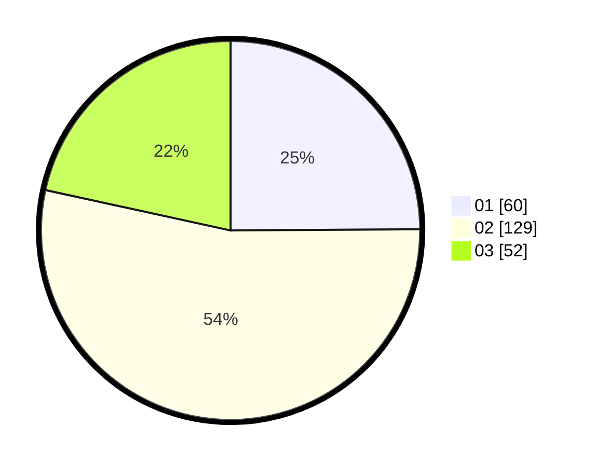

# Hasil

Hasil perolehan suara paslon dapat dilihat pada file paslon-01.txt, paslon-02.txt, dan paslon-03.txt.

Jika tidak ada, artinya data tersebut belum ada pada SIREKAP.

## Perolehan Suara

 * Paslon 01: **60**.
 * Paslon 02: **129**.
 * Paslon 03: **52**.

## Foto C Plano

https://sirekap-obj-formc.kpu.go.id/8ada/pemilu/ppwp/31/75/06/10/03/3175061003342-20240215-213819--c44c3137-84db-4e24-b5b5-157044aacd3d.jpg

https://sirekap-obj-formc.kpu.go.id/8ada/pemilu/ppwp/31/75/06/10/03/3175061003342-20240215-213821--99d5ffff-7d47-4c5c-be7d-98c54544f1b0.jpg

https://sirekap-obj-formc.kpu.go.id/8ada/pemilu/ppwp/31/75/06/10/03/3175061003342-20240215-213820--9182e3fa-aed9-47af-a6a2-157ae076ca61.jpg

## DATA PEMILIH TETAP

Jumlah pemilih dalam DPT: **282**.
 * L: **132**.
 * P: **150**.

## DATA PENGGUNA HAK PILIH

Jumlah pengguna hak pilih dalam DPT: **237**.
 * L: **109**.
 * P: **128**.

Jumlah pengguna hak pilih dalam DPTb: **3**.
 * L: **1**.
 * P: **2**.

Jumlah pengguna hak pilih dalam DPK: **5**.
 * L: **1**.
 * P: **4**.

Jumlah pengguna hak pilih: **245**.
 * L: **111**.
 * P: **134**.

## JUMLAH SUARA SAH DAN TIDAK SAH

JUMLAH SELURUH SUARA SAH: **241**.

JUMLAH SUARA TIDAK SAH: **4**.

JUMLAH SELURUH SUARA SAH DAN SUARA TIDAK SAH: **245**.
