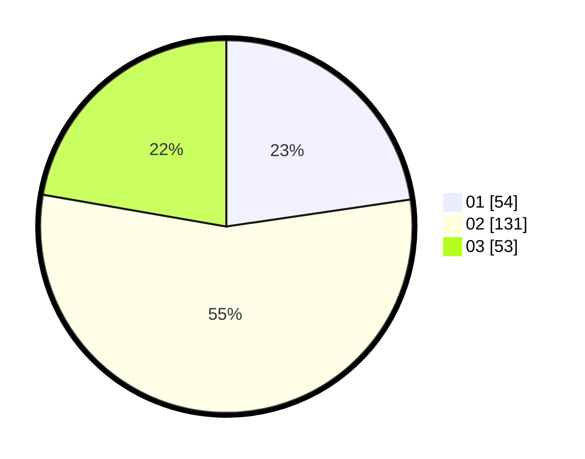

# Hasil

Hasil perolehan suara paslon dapat dilihat pada file paslon-01.txt, paslon-02.txt, dan paslon-03.txt.

Jika tidak ada, artinya data tersebut belum ada pada SIREKAP.

## Perolehan Suara

 * Paslon 01: **54**.
 * Paslon 02: **131**.
 * Paslon 03: **53**.

## Foto C Plano

https://sirekap-obj-formc.kpu.go.id/cc72/pemilu/ppwp/31/75/06/10/03/3175061003345-20240215-211503--c5638138-586a-45b1-a026-cb8f695398dd.jpg

https://sirekap-obj-formc.kpu.go.id/cc72/pemilu/ppwp/31/75/06/10/03/3175061003345-20240215-211504--b5266d61-b5e4-43bb-9014-ef993051b754.jpg

https://sirekap-obj-formc.kpu.go.id/cc72/pemilu/ppwp/31/75/06/10/03/3175061003345-20240215-211504--9c6d0e66-dd96-406d-8b5d-b0ae2da36424.jpg

## DATA PEMILIH TETAP

Jumlah pemilih dalam DPT: **287**.
 * L: **131**.
 * P: **156**.

## DATA PENGGUNA HAK PILIH

Jumlah pengguna hak pilih dalam DPT: **233**.
 * L: **102**.
 * P: **131**.

Jumlah pengguna hak pilih dalam DPTb: **6**.
 * L: **5**.
 * P: **1**.

Jumlah pengguna hak pilih dalam DPK: **0**.
 * L: **0**.
 * P: **0**.

Jumlah pengguna hak pilih: **239**.
 * L: **107**.
 * P: **132**.

## JUMLAH SUARA SAH DAN TIDAK SAH

JUMLAH SELURUH SUARA SAH: **238**.

JUMLAH SUARA TIDAK SAH: **1**.

JUMLAH SELURUH SUARA SAH DAN SUARA TIDAK SAH: **239**.
