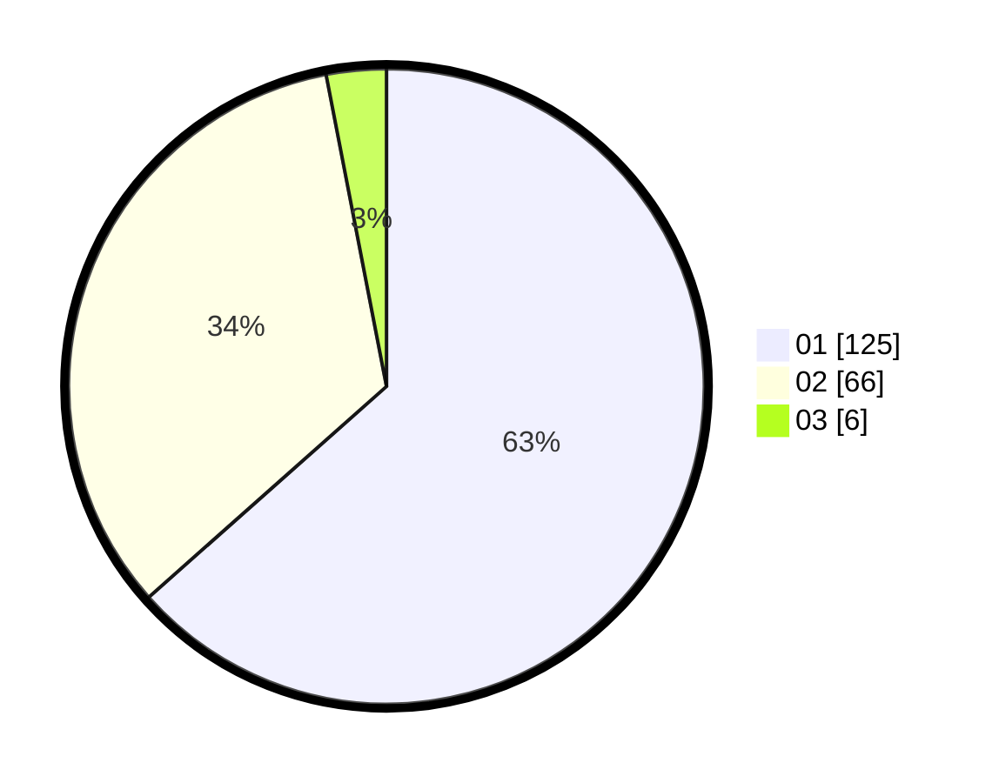

# Hasil

Hasil perolehan suara paslon dapat dilihat pada file paslon-01.txt, paslon-02.txt, dan paslon-03.txt.

Jika tidak ada, artinya data tersebut belum ada pada SIREKAP.

## Perolehan Suara

 * Paslon 01: **125**.
 * Paslon 02: **66**.
 * Paslon 03: **6**.

## Foto C Plano

https://sirekap-obj-formc.kpu.go.id/e4e8/pemilu/ppwp/31/75/06/10/04/3175061004011-20240216-132035--f0d357f2-23de-4da8-94ba-959feef5494f.jpg

https://sirekap-obj-formc.kpu.go.id/e4e8/pemilu/ppwp/31/75/06/10/04/3175061004011-20240216-132036--a7639ac0-c4de-4308-a58a-9613181655e8.jpg

https://sirekap-obj-formc.kpu.go.id/e4e8/pemilu/ppwp/31/75/06/10/04/3175061004011-20240216-132036--ffa1540f-681f-427e-9231-6a0089885b29.jpg

## DATA PEMILIH TETAP

Jumlah pemilih dalam DPT: **255**.
 * L: **127**.
 * P: **128**.

## DATA PENGGUNA HAK PILIH

Jumlah pengguna hak pilih dalam DPT: **198**.
 * L: **95**.
 * P: **103**.

Jumlah pengguna hak pilih dalam DPTb: **0**.
 * L: **0**.
 * P: **0**.

Jumlah pengguna hak pilih dalam DPK: **0**.
 * L: **0**.
 * P: **0**.

Jumlah pengguna hak pilih: **198**.
 * L: **95**.
 * P: **103**.

## JUMLAH SUARA SAH DAN TIDAK SAH

JUMLAH SELURUH SUARA SAH: **197**.

JUMLAH SUARA TIDAK SAH: **1**.

JUMLAH SELURUH SUARA SAH DAN SUARA TIDAK SAH: **198**.
