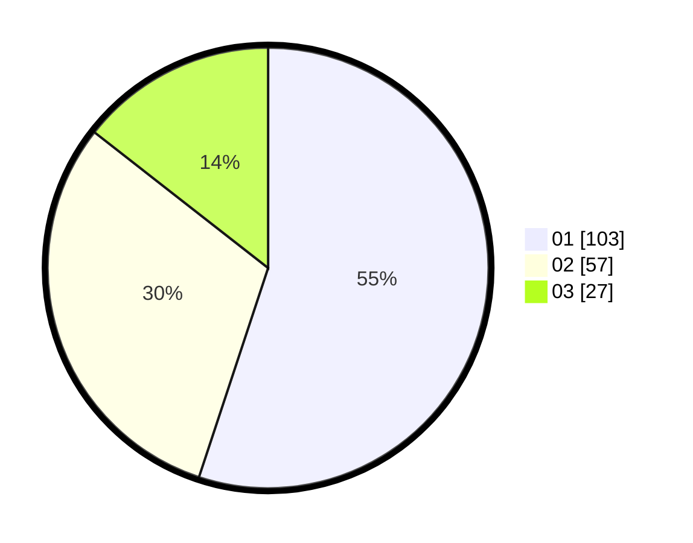

# Hasil

Hasil perolehan suara paslon dapat dilihat pada file paslon-01.txt, paslon-02.txt, dan paslon-03.txt.

Jika tidak ada, artinya data tersebut belum ada pada SIREKAP.

## Perolehan Suara

 * Paslon 01: **103**.
 * Paslon 02: **57**.
 * Paslon 03: **27**.

## Foto C Plano

https://sirekap-obj-formc.kpu.go.id/807c/pemilu/ppwp/31/75/06/10/04/3175061004015-20240214-194528--1f21509f-223e-4312-adde-35e38c2d2395.jpg

https://sirekap-obj-formc.kpu.go.id/807c/pemilu/ppwp/31/75/06/10/04/3175061004015-20240214-194644--f2b565ee-8092-489b-b5ea-3c9115c06fbb.jpg

https://sirekap-obj-formc.kpu.go.id/807c/pemilu/ppwp/31/75/06/10/04/3175061004015-20240214-200620--35732e96-755a-4369-86e3-12929dd81880.jpg

## DATA PEMILIH TETAP

Jumlah pemilih dalam DPT: **250**.
 * L: **123**.
 * P: **127**.

## DATA PENGGUNA HAK PILIH

Jumlah pengguna hak pilih dalam DPT: **188**.
 * L: **94**.
 * P: **94**.

Jumlah pengguna hak pilih dalam DPTb: **0**.
 * L: **0**.
 * P: **0**.

Jumlah pengguna hak pilih dalam DPK: **5**.
 * L: **4**.
 * P: **1**.

Jumlah pengguna hak pilih: **193**.
 * L: **98**.
 * P: **95**.

## JUMLAH SUARA SAH DAN TIDAK SAH

JUMLAH SELURUH SUARA SAH: **187**.

JUMLAH SUARA TIDAK SAH: **6**.

JUMLAH SELURUH SUARA SAH DAN SUARA TIDAK SAH: **193**.
