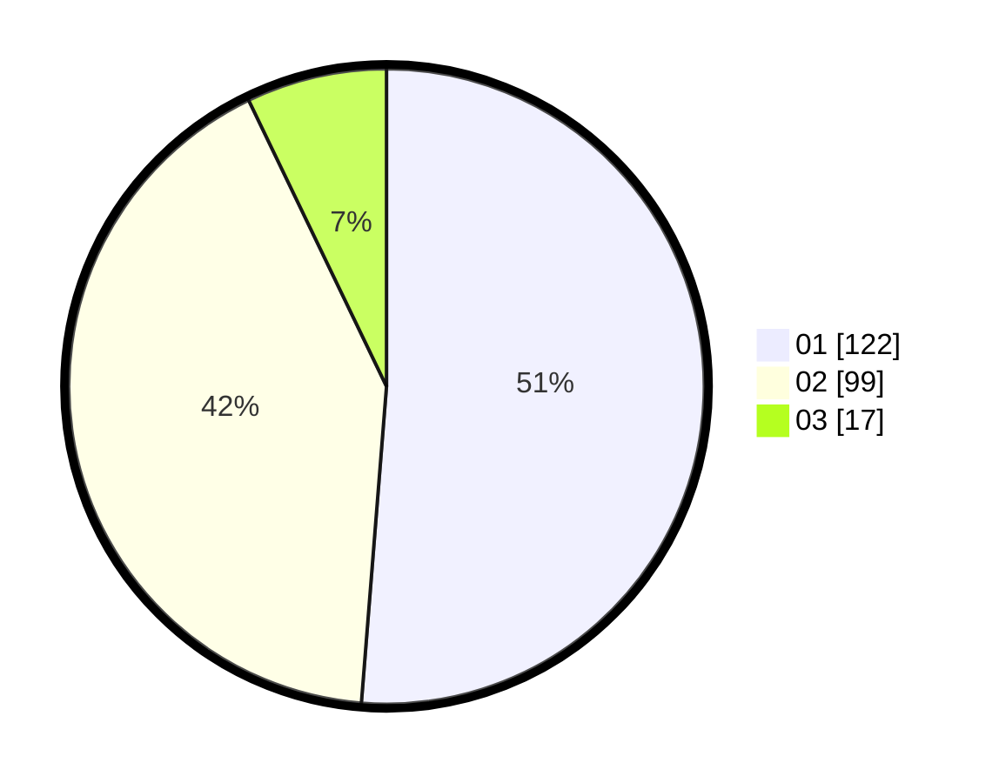

# Hasil

Hasil perolehan suara paslon dapat dilihat pada file paslon-01.txt, paslon-02.txt, dan paslon-03.txt.

Jika tidak ada, artinya data tersebut belum ada pada SIREKAP.

## Perolehan Suara

 * Paslon 01: **122**.
 * Paslon 02: **99**.
 * Paslon 03: **17**.

## Foto C Plano

https://sirekap-obj-formc.kpu.go.id/7554/pemilu/ppwp/31/75/06/10/04/3175061004022-20240214-203312--fdff1a79-f563-494e-924d-0e8b53442ccb.jpg

https://sirekap-obj-formc.kpu.go.id/7554/pemilu/ppwp/31/75/06/10/04/3175061004022-20240214-203409--c6c2d9e9-cc46-4bdf-b3ed-396f9bd84325.jpg

https://sirekap-obj-formc.kpu.go.id/7554/pemilu/ppwp/31/75/06/10/04/3175061004022-20240214-203554--47fa1c71-537b-4286-be63-cb8e18707e1c.jpg

## DATA PEMILIH TETAP

Jumlah pemilih dalam DPT: **293**.
 * L: **148**.
 * P: **145**.

## DATA PENGGUNA HAK PILIH

Jumlah pengguna hak pilih dalam DPT: **241**.
 * L: **118**.
 * P: **123**.

Jumlah pengguna hak pilih dalam DPTb: **0**.
 * L: **0**.
 * P: **0**.

Jumlah pengguna hak pilih dalam DPK: **0**.
 * L: **0**.
 * P: **0**.

Jumlah pengguna hak pilih: **241**.
 * L: **118**.
 * P: **123**.

## JUMLAH SUARA SAH DAN TIDAK SAH

JUMLAH SELURUH SUARA SAH: **238**.

JUMLAH SUARA TIDAK SAH: **3**.

JUMLAH SELURUH SUARA SAH DAN SUARA TIDAK SAH: **241**.
