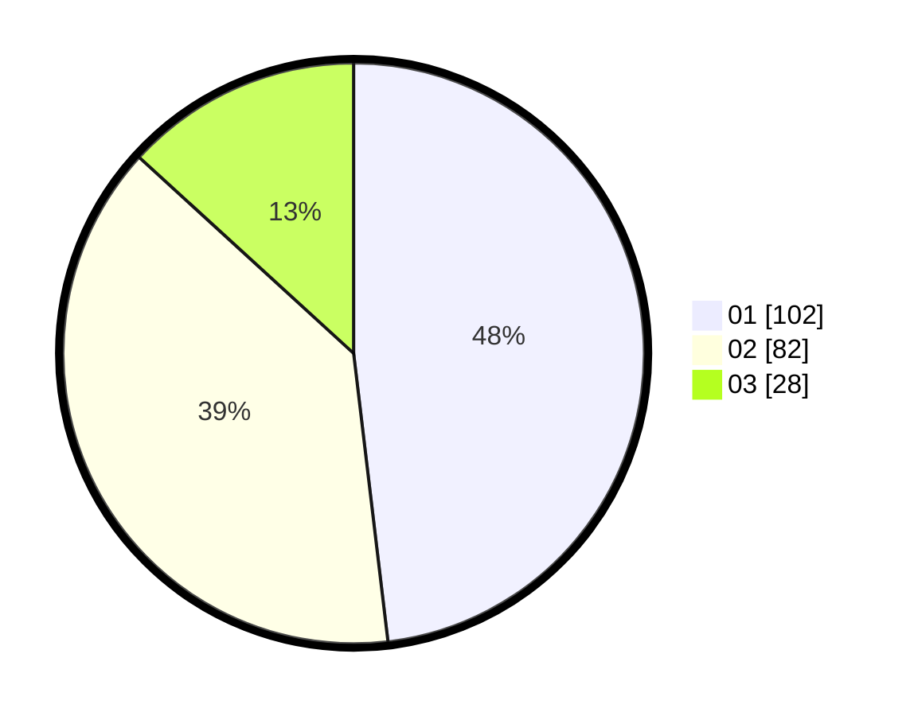

# Hasil

Hasil perolehan suara paslon dapat dilihat pada file paslon-01.txt, paslon-02.txt, dan paslon-03.txt.

Jika tidak ada, artinya data tersebut belum ada pada SIREKAP.

## Perolehan Suara

 * Paslon 01: **102**.
 * Paslon 02: **82**.
 * Paslon 03: **28**.

## Foto C Plano

https://sirekap-obj-formc.kpu.go.id/8af8/pemilu/ppwp/31/75/06/10/04/3175061004030-20240214-155516--18cc1ef4-500d-4d96-a13a-2b516e11f314.jpg

https://sirekap-obj-formc.kpu.go.id/8af8/pemilu/ppwp/31/75/06/10/04/3175061004030-20240214-155347--a6611409-984c-4042-a4a4-fe8348a63682.jpg

https://sirekap-obj-formc.kpu.go.id/8af8/pemilu/ppwp/31/75/06/10/04/3175061004030-20240214-160055--728accfe-eac0-4376-b4d4-1f4f4dae1e20.jpg

## DATA PEMILIH TETAP

Jumlah pemilih dalam DPT: **255**.
 * L: **128**.
 * P: **127**.

## DATA PENGGUNA HAK PILIH

Jumlah pengguna hak pilih dalam DPT: **206**.
 * L: **103**.
 * P: **103**.

Jumlah pengguna hak pilih dalam DPTb: **2**.
 * L: **0**.
 * P: **2**.

Jumlah pengguna hak pilih dalam DPK: **5**.
 * L: **2**.
 * P: **3**.

Jumlah pengguna hak pilih: **213**.
 * L: **105**.
 * P: **108**.

## JUMLAH SUARA SAH DAN TIDAK SAH

JUMLAH SELURUH SUARA SAH: **212**.

JUMLAH SUARA TIDAK SAH: **1**.

JUMLAH SELURUH SUARA SAH DAN SUARA TIDAK SAH: **213**.
