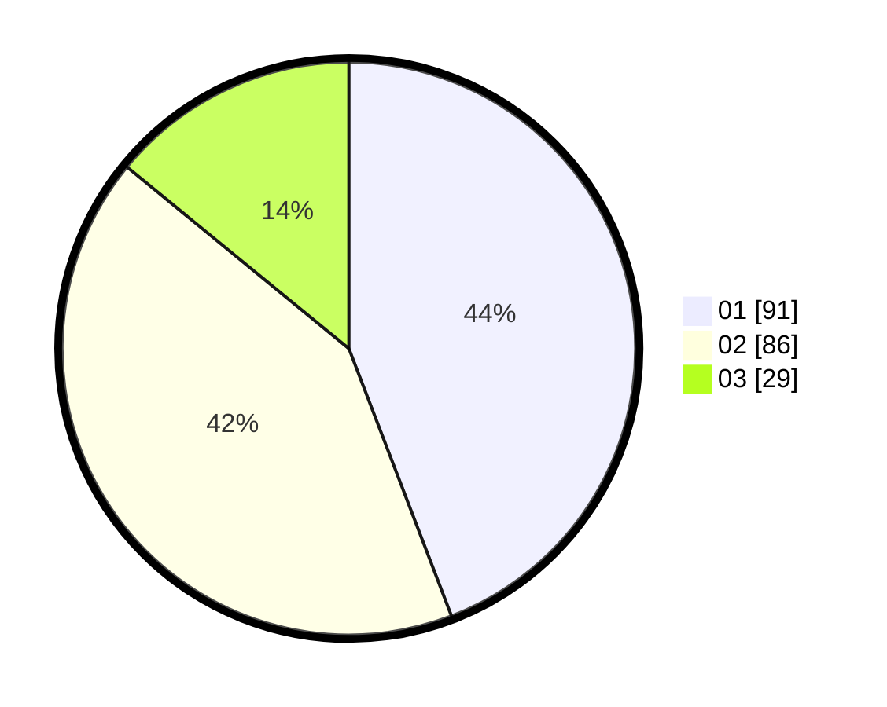

# Hasil

Hasil perolehan suara paslon dapat dilihat pada file paslon-01.txt, paslon-02.txt, dan paslon-03.txt.

Jika tidak ada, artinya data tersebut belum ada pada SIREKAP.

## Perolehan Suara

 * Paslon 01: **91**.
 * Paslon 02: **86**.
 * Paslon 03: **29**.

## Foto C Plano

https://sirekap-obj-formc.kpu.go.id/4931/pemilu/ppwp/31/75/06/10/04/3175061004054-20240216-004543--09c1419f-97eb-4033-b3f7-64321e81ef8f.jpg

https://sirekap-obj-formc.kpu.go.id/4931/pemilu/ppwp/31/75/06/10/04/3175061004054-20240216-004545--593fea91-d55b-4951-b01d-de6783807280.jpg

https://sirekap-obj-formc.kpu.go.id/4931/pemilu/ppwp/31/75/06/10/04/3175061004054-20240216-004544--9c6d4739-11c0-46a4-81d1-77cbc7b11202.jpg

## DATA PEMILIH TETAP

Jumlah pemilih dalam DPT: **208**.
 * L: **102**.
 * P: **106**.

## DATA PENGGUNA HAK PILIH

Jumlah pengguna hak pilih dalam DPT: **208**.
 * L: **102**.
 * P: **106**.

Jumlah pengguna hak pilih dalam DPTb: **0**.
 * L: **0**.
 * P: **0**.

Jumlah pengguna hak pilih dalam DPK: **1**.
 * L: **1**.
 * P: **0**.

Jumlah pengguna hak pilih: **209**.
 * L: **103**.
 * P: **106**.

## JUMLAH SUARA SAH DAN TIDAK SAH

JUMLAH SELURUH SUARA SAH: **206**.

JUMLAH SUARA TIDAK SAH: **3**.

JUMLAH SELURUH SUARA SAH DAN SUARA TIDAK SAH: **209**.
