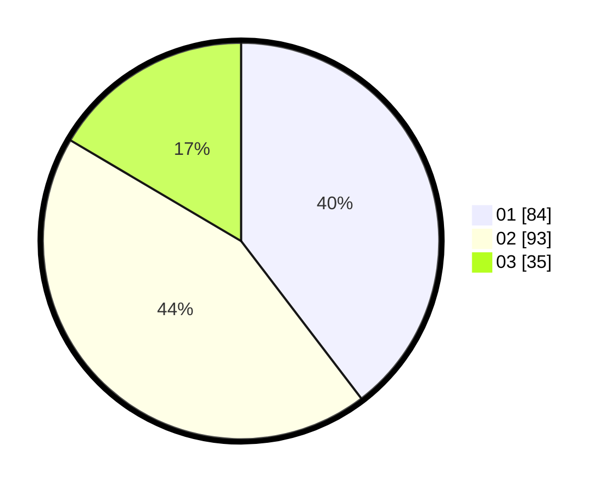

# Hasil

Hasil perolehan suara paslon dapat dilihat pada file paslon-01.txt, paslon-02.txt, dan paslon-03.txt.

Jika tidak ada, artinya data tersebut belum ada pada SIREKAP.

## Perolehan Suara

 * Paslon 01: **84**.
 * Paslon 02: **93**.
 * Paslon 03: **35**.

## Foto C Plano

https://sirekap-obj-formc.kpu.go.id/d4c6/pemilu/ppwp/31/75/06/10/04/3175061004058-20240214-231350--658f989e-18f5-45cc-807d-8b12050e4d2d.jpg

https://sirekap-obj-formc.kpu.go.id/d4c6/pemilu/ppwp/31/75/06/10/04/3175061004058-20240214-231726--33ed54ec-72ba-4201-a7ca-857f4e2a721d.jpg

https://sirekap-obj-formc.kpu.go.id/d4c6/pemilu/ppwp/31/75/06/10/04/3175061004058-20240214-211846--5c1aa1de-1294-49d1-afa0-aeac1bc8649a.jpg
