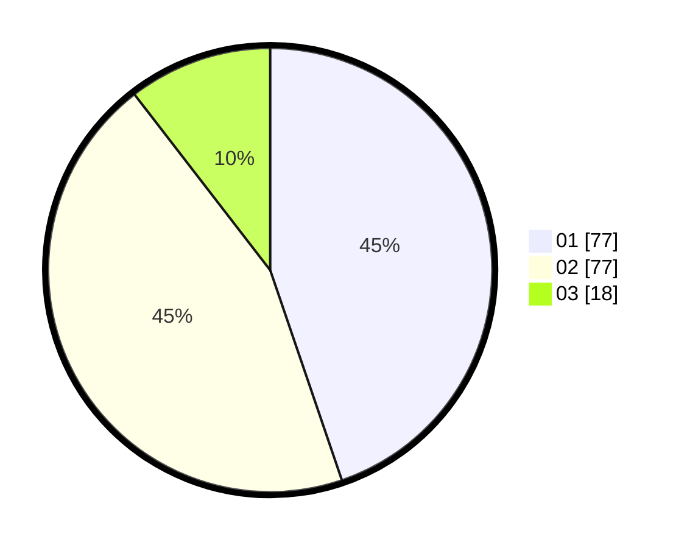

# Hasil

Hasil perolehan suara paslon dapat dilihat pada file paslon-01.txt, paslon-02.txt, dan paslon-03.txt.

Jika tidak ada, artinya data tersebut belum ada pada SIREKAP.

## Perolehan Suara

 * Paslon 01: **77**.
 * Paslon 02: **77**.
 * Paslon 03: **18**.

## Foto C Plano

https://sirekap-obj-formc.kpu.go.id/3053/pemilu/ppwp/31/75/06/10/04/3175061004063-20240216-144128--5ce48fea-5cf4-48f7-9ab5-b18bdaf10e26.jpg

https://sirekap-obj-formc.kpu.go.id/3053/pemilu/ppwp/31/75/06/10/04/3175061004063-20240216-144129--fd7a5702-63fa-4b46-9c6d-f2b1089abbcb.jpg

https://sirekap-obj-formc.kpu.go.id/3053/pemilu/ppwp/31/75/06/10/04/3175061004063-20240214-185341--6deb6d86-fbbb-476f-9b7b-b09f06772c1e.jpg

## DATA PEMILIH TETAP

Jumlah pemilih dalam DPT: **257**.
 * L: **129**.
 * P: **128**.

## DATA PENGGUNA HAK PILIH

Jumlah pengguna hak pilih dalam DPT: **177**.
 * L: **85**.
 * P: **92**.

Jumlah pengguna hak pilih dalam DPTb: **3**.
 * L: **2**.
 * P: **1**.

Jumlah pengguna hak pilih dalam DPK: **0**.
 * L: **0**.
 * P: **0**.

Jumlah pengguna hak pilih: **180**.
 * L: **87**.
 * P: **93**.

## JUMLAH SUARA SAH DAN TIDAK SAH

JUMLAH SELURUH SUARA SAH: **172**.

JUMLAH SUARA TIDAK SAH: **8**.

JUMLAH SELURUH SUARA SAH DAN SUARA TIDAK SAH: **180**.
