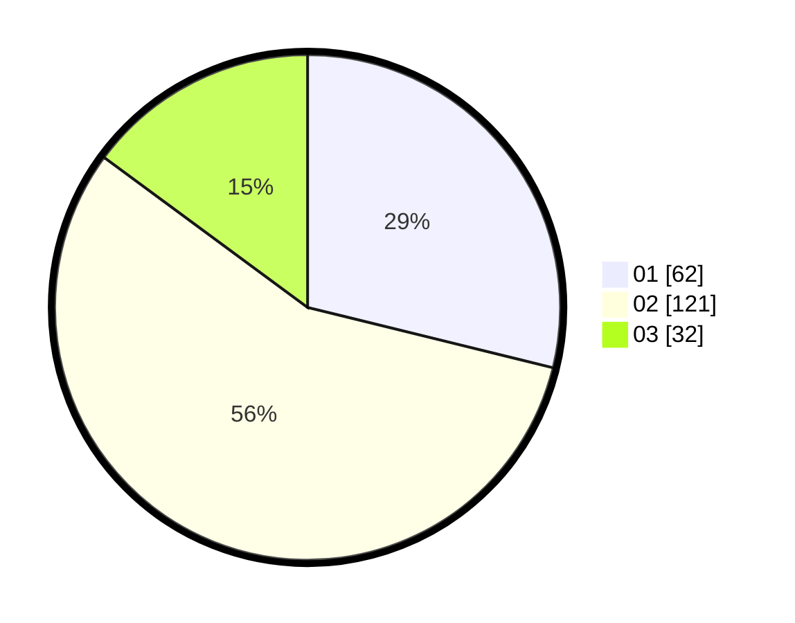

# Hasil

Hasil perolehan suara paslon dapat dilihat pada file paslon-01.txt, paslon-02.txt, dan paslon-03.txt.

Jika tidak ada, artinya data tersebut belum ada pada SIREKAP.

## Perolehan Suara

 * Paslon 01: **62**.
 * Paslon 02: **121**.
 * Paslon 03: **32**.

## Foto C Plano

https://sirekap-obj-formc.kpu.go.id/0f72/pemilu/ppwp/31/75/06/10/04/3175061004068-20240216-232045--f2761828-2679-4402-8b5c-f7dcc753077a.jpg

https://sirekap-obj-formc.kpu.go.id/0f72/pemilu/ppwp/31/75/06/10/04/3175061004068-20240216-232445--ed9e7680-97ae-436f-81be-24ab98bcdba2.jpg

https://sirekap-obj-formc.kpu.go.id/0f72/pemilu/ppwp/31/75/06/10/04/3175061004068-20240216-232653--28c10ad0-985c-41c1-bff0-a47ba92700be.jpg

## DATA PEMILIH TETAP

Jumlah pemilih dalam DPT: **215**.
 * L: **101**.
 * P: **114**.

## DATA PENGGUNA HAK PILIH

Jumlah pengguna hak pilih dalam DPT: **214**.
 * L: **100**.
 * P: **114**.

Jumlah pengguna hak pilih dalam DPTb: **0**.
 * L: **0**.
 * P: **0**.

Jumlah pengguna hak pilih dalam DPK: **1**.
 * L: **1**.
 * P: **0**.

Jumlah pengguna hak pilih: **215**.
 * L: **101**.
 * P: **114**.

## JUMLAH SUARA SAH DAN TIDAK SAH

JUMLAH SELURUH SUARA SAH: **215**.

JUMLAH SUARA TIDAK SAH: **0**.

JUMLAH SELURUH SUARA SAH DAN SUARA TIDAK SAH: **215**.
