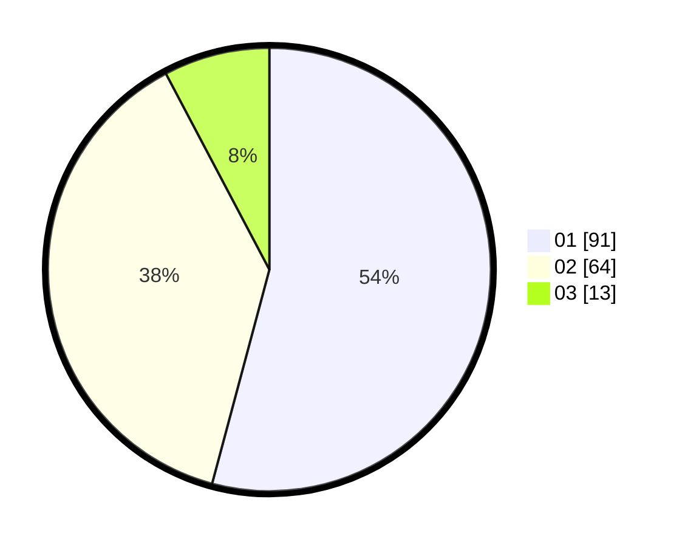

# Hasil

Hasil perolehan suara paslon dapat dilihat pada file paslon-01.txt, paslon-02.txt, dan paslon-03.txt.

Jika tidak ada, artinya data tersebut belum ada pada SIREKAP.

## Perolehan Suara

 * Paslon 01: **91**.
 * Paslon 02: **64**.
 * Paslon 03: **13**.

## Foto C Plano

https://sirekap-obj-formc.kpu.go.id/0c30/pemilu/ppwp/31/75/06/10/04/3175061004071-20240214-155129--171ad2ee-cd2e-47e4-a6fc-768e1aef6f2f.jpg

https://sirekap-obj-formc.kpu.go.id/0c30/pemilu/ppwp/31/75/06/10/04/3175061004071-20240214-194918--9eb498b0-bfb1-4eaa-bcc3-c45d77dd5b03.jpg

https://sirekap-obj-formc.kpu.go.id/0c30/pemilu/ppwp/31/75/06/10/04/3175061004071-20240214-201329--f11868e4-e8d3-4b2e-9f9b-89d36ed5e1a5.jpg

## DATA PEMILIH TETAP

Jumlah pemilih dalam DPT: **233**.
 * L: **112**.
 * P: **121**.

## DATA PENGGUNA HAK PILIH

Jumlah pengguna hak pilih dalam DPT: **167**.
 * L: **75**.
 * P: **92**.

Jumlah pengguna hak pilih dalam DPTb: **0**.
 * L: **0**.
 * P: **0**.

Jumlah pengguna hak pilih dalam DPK: **1**.
 * L: **1**.
 * P: **0**.

Jumlah pengguna hak pilih: **168**.
 * L: **76**.
 * P: **92**.

## JUMLAH SUARA SAH DAN TIDAK SAH

JUMLAH SELURUH SUARA SAH: **168**.

JUMLAH SUARA TIDAK SAH: **0**.

JUMLAH SELURUH SUARA SAH DAN SUARA TIDAK SAH: **168**.
