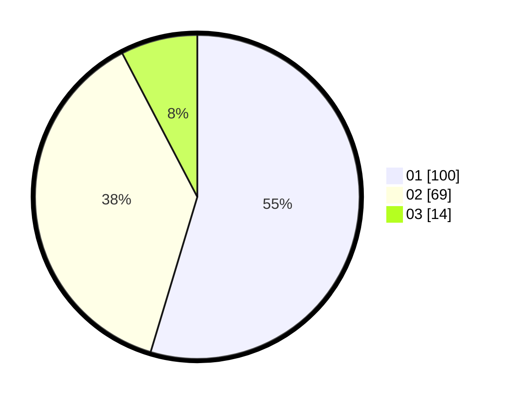

# Hasil

Hasil perolehan suara paslon dapat dilihat pada file paslon-01.txt, paslon-02.txt, dan paslon-03.txt.

Jika tidak ada, artinya data tersebut belum ada pada SIREKAP.

## Perolehan Suara

 * Paslon 01: **100**.
 * Paslon 02: **69**.
 * Paslon 03: **14**.

## Foto C Plano

https://sirekap-obj-formc.kpu.go.id/4294/pemilu/ppwp/31/75/06/10/04/3175061004072-20240214-202739--6f7a8ce7-2d33-462c-b27b-db73e6152292.jpg

https://sirekap-obj-formc.kpu.go.id/4294/pemilu/ppwp/31/75/06/10/04/3175061004072-20240214-211646--4b1eeae6-1100-4d30-a9b4-5466709bd7ef.jpg

https://sirekap-obj-formc.kpu.go.id/4294/pemilu/ppwp/31/75/06/10/04/3175061004072-20240214-202937--c1483581-f7b3-4527-b09d-3a3810819d42.jpg

## DATA PEMILIH TETAP

Jumlah pemilih dalam DPT: **213**.
 * L: **105**.
 * P: **108**.

## DATA PENGGUNA HAK PILIH

Jumlah pengguna hak pilih dalam DPT: **184**.
 * L: **93**.
 * P: **91**.

Jumlah pengguna hak pilih dalam DPTb: **1**.
 * L: **1**.
 * P: **0**.

Jumlah pengguna hak pilih dalam DPK: **0**.
 * L: **0**.
 * P: **0**.

Jumlah pengguna hak pilih: **185**.
 * L: **94**.
 * P: **91**.

## JUMLAH SUARA SAH DAN TIDAK SAH

JUMLAH SELURUH SUARA SAH: **183**.

JUMLAH SUARA TIDAK SAH: **2**.

JUMLAH SELURUH SUARA SAH DAN SUARA TIDAK SAH: **185**.
