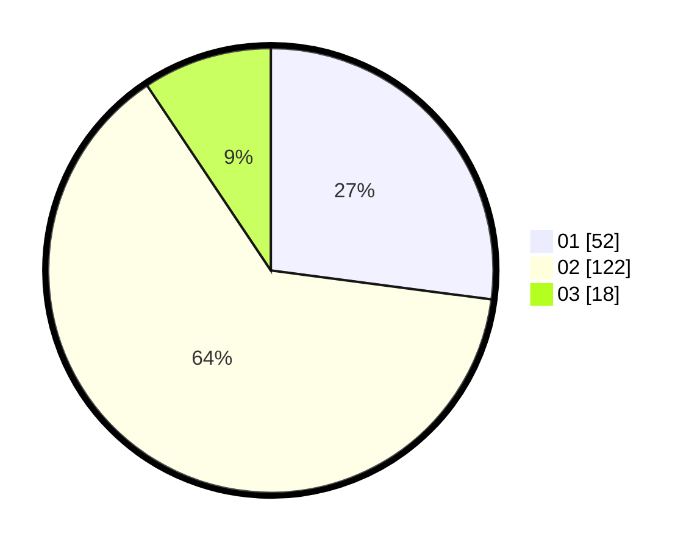

# Hasil

Hasil perolehan suara paslon dapat dilihat pada file paslon-01.txt, paslon-02.txt, dan paslon-03.txt.

Jika tidak ada, artinya data tersebut belum ada pada SIREKAP.

## Perolehan Suara

 * Paslon 01: **52**.
 * Paslon 02: **122**.
 * Paslon 03: **18**.

## Foto C Plano

https://sirekap-obj-formc.kpu.go.id/2031/pemilu/ppwp/31/75/06/10/04/3175061004112-20240214-225126--882c7049-2c87-44de-81ae-42e5c463664b.jpg

https://sirekap-obj-formc.kpu.go.id/2031/pemilu/ppwp/31/75/06/10/04/3175061004112-20240214-212530--9bb1ce41-f331-4f0c-a4ac-afb0098c6790.jpg

https://sirekap-obj-formc.kpu.go.id/2031/pemilu/ppwp/31/75/06/10/04/3175061004112-20240214-212608--9afd69c2-fb53-4100-a54b-129d4939368a.jpg
