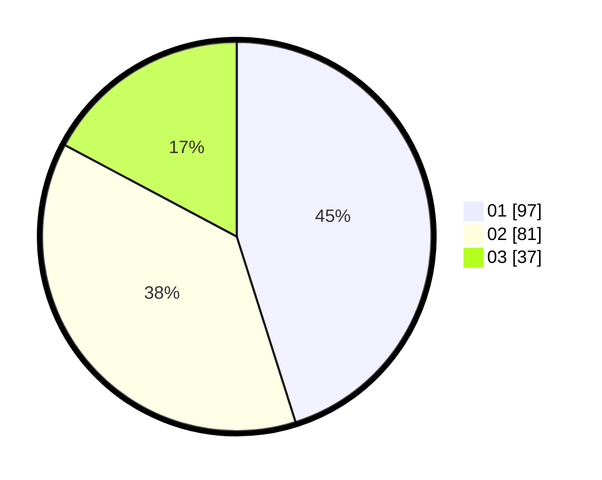

# Hasil

Hasil perolehan suara paslon dapat dilihat pada file paslon-01.txt, paslon-02.txt, dan paslon-03.txt.

Jika tidak ada, artinya data tersebut belum ada pada SIREKAP.

## Perolehan Suara

 * Paslon 01: **97**.
 * Paslon 02: **81**.
 * Paslon 03: **37**.

## Foto C Plano

https://sirekap-obj-formc.kpu.go.id/5fb7/pemilu/ppwp/31/75/06/10/04/3175061004118-20240214-204753--eb0787b8-b604-4f04-a465-4f1818d6576b.jpg

https://sirekap-obj-formc.kpu.go.id/5fb7/pemilu/ppwp/31/75/06/10/04/3175061004118-20240214-204240--a7813cd2-3000-4f35-8f93-4e9b962de2a9.jpg

https://sirekap-obj-formc.kpu.go.id/5fb7/pemilu/ppwp/31/75/06/10/04/3175061004118-20240214-204253--dea6f173-ec2b-4a5f-ab45-378aeecf047c.jpg

## DATA PEMILIH TETAP

Jumlah pemilih dalam DPT: **264**.
 * L: **135**.
 * P: **129**.

## DATA PENGGUNA HAK PILIH

Jumlah pengguna hak pilih dalam DPT: **207**.
 * L: **99**.
 * P: **108**.

Jumlah pengguna hak pilih dalam DPTb: **1**.
 * L: **0**.
 * P: **1**.

Jumlah pengguna hak pilih dalam DPK: **9**.
 * L: **4**.
 * P: **5**.

Jumlah pengguna hak pilih: **217**.
 * L: **103**.
 * P: **114**.

## JUMLAH SUARA SAH DAN TIDAK SAH

JUMLAH SELURUH SUARA SAH: **215**.

JUMLAH SUARA TIDAK SAH: **2**.

JUMLAH SELURUH SUARA SAH DAN SUARA TIDAK SAH: **217**.
