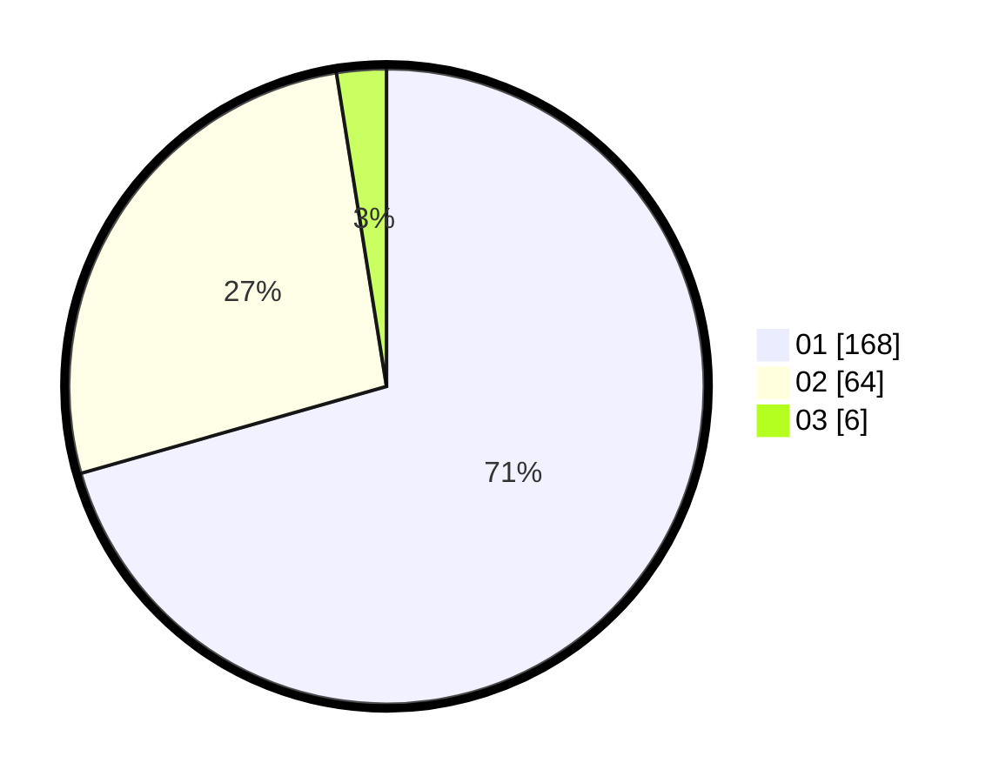

# Hasil

Hasil perolehan suara paslon dapat dilihat pada file paslon-01.txt, paslon-02.txt, dan paslon-03.txt.

Jika tidak ada, artinya data tersebut belum ada pada SIREKAP.

## Perolehan Suara

 * Paslon 01: **168**.
 * Paslon 02: **64**.
 * Paslon 03: **6**.

## Foto C Plano

https://sirekap-obj-formc.kpu.go.id/2cfa/pemilu/ppwp/31/75/06/10/04/3175061004121-20240216-150028--2d1b5492-f227-467c-badc-f0443fd4df3f.jpg

https://sirekap-obj-formc.kpu.go.id/2cfa/pemilu/ppwp/31/75/06/10/04/3175061004121-20240214-193344--51896bbb-f358-444f-94e4-f201ed914e9b.jpg

https://sirekap-obj-formc.kpu.go.id/2cfa/pemilu/ppwp/31/75/06/10/04/3175061004121-20240214-193358--59098e03-d3a2-49dc-af4c-89abf8e675b2.jpg

## DATA PEMILIH TETAP

Jumlah pemilih dalam DPT: **280**.
 * L: **138**.
 * P: **142**.

## DATA PENGGUNA HAK PILIH

Jumlah pengguna hak pilih dalam DPT: **243**.
 * L: **117**.
 * P: **126**.

Jumlah pengguna hak pilih dalam DPTb: **0**.
 * L: **0**.
 * P: **0**.

Jumlah pengguna hak pilih dalam DPK: **0**.
 * L: **0**.
 * P: **0**.

Jumlah pengguna hak pilih: **243**.
 * L: **117**.
 * P: **126**.

## JUMLAH SUARA SAH DAN TIDAK SAH

JUMLAH SELURUH SUARA SAH: **238**.

JUMLAH SUARA TIDAK SAH: **5**.

JUMLAH SELURUH SUARA SAH DAN SUARA TIDAK SAH: **243**.
