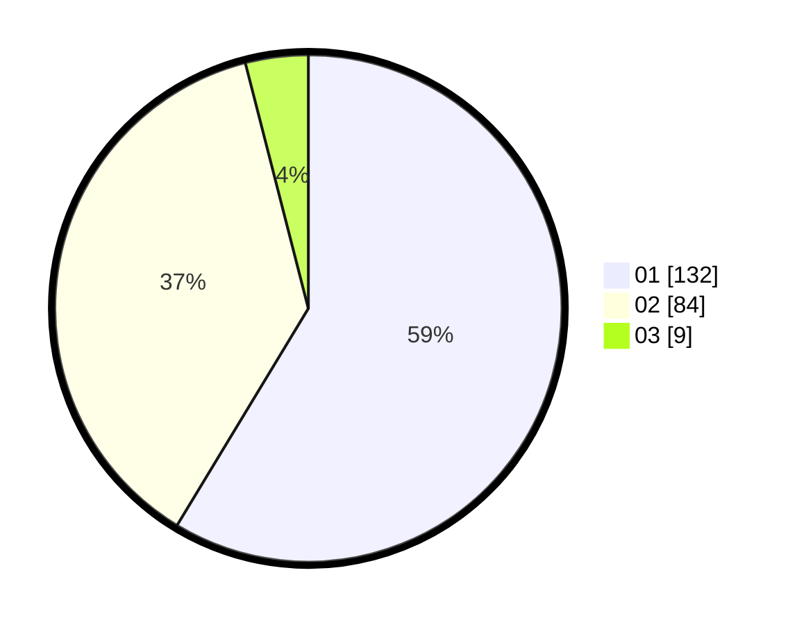

# Hasil

Hasil perolehan suara paslon dapat dilihat pada file paslon-01.txt, paslon-02.txt, dan paslon-03.txt.

Jika tidak ada, artinya data tersebut belum ada pada SIREKAP.

## Perolehan Suara

 * Paslon 01: **132**.
 * Paslon 02: **84**.
 * Paslon 03: **9**.

## Foto C Plano

https://sirekap-obj-formc.kpu.go.id/22ce/pemilu/ppwp/31/75/06/10/04/3175061004132-20240214-193512--71890f58-88b5-435f-bed1-62b0b8c21037.jpg

https://sirekap-obj-formc.kpu.go.id/22ce/pemilu/ppwp/31/75/06/10/04/3175061004132-20240214-190839--998fd040-a4a6-48e6-b04b-32cdeebc9a62.jpg

https://sirekap-obj-formc.kpu.go.id/22ce/pemilu/ppwp/31/75/06/10/04/3175061004132-20240214-190854--448021ed-cba7-4429-87b1-a743b46ab96e.jpg

## DATA PEMILIH TETAP

Jumlah pemilih dalam DPT: **227**.
 * L: **117**.
 * P: **110**.

## DATA PENGGUNA HAK PILIH

Jumlah pengguna hak pilih dalam DPT: **271**.
 * L: **139**.
 * P: **132**.

Jumlah pengguna hak pilih dalam DPTb: **1**.
 * L: **1**.
 * P: **0**.

Jumlah pengguna hak pilih dalam DPK: **1**.
 * L: **1**.
 * P: **0**.

Jumlah pengguna hak pilih: **227**.
 * L: **117**.
 * P: **110**.

## JUMLAH SUARA SAH DAN TIDAK SAH

JUMLAH SELURUH SUARA SAH: **225**.

JUMLAH SUARA TIDAK SAH: **2**.

JUMLAH SELURUH SUARA SAH DAN SUARA TIDAK SAH: **227**.
