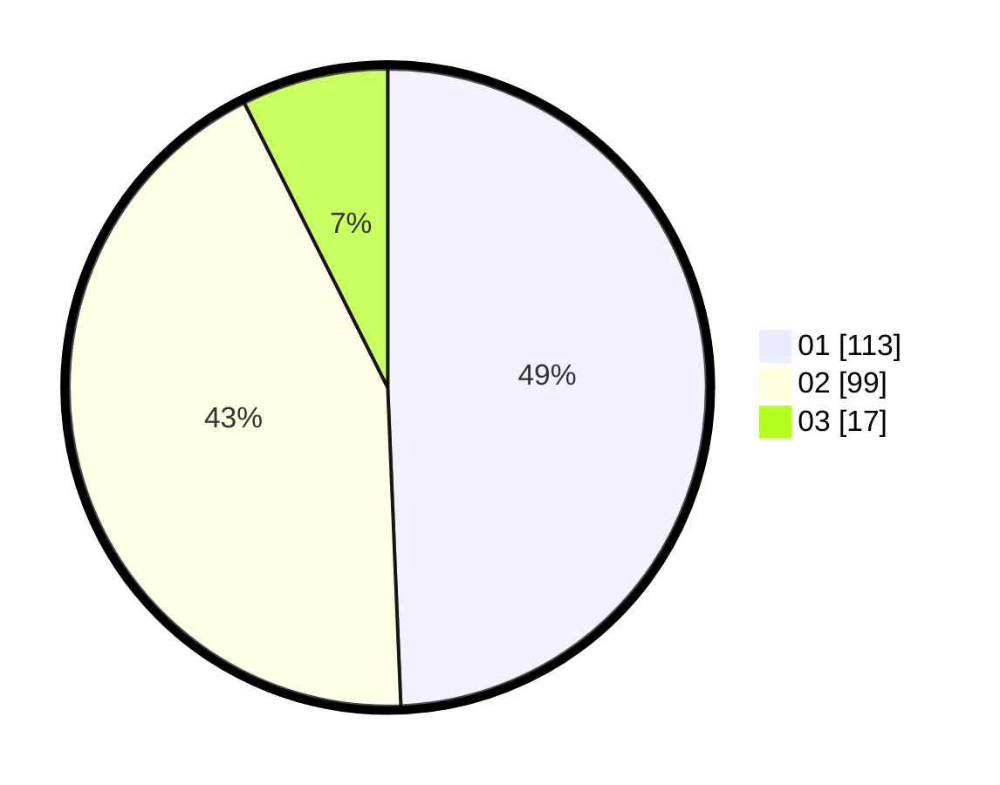

# Hasil

Hasil perolehan suara paslon dapat dilihat pada file paslon-01.txt, paslon-02.txt, dan paslon-03.txt.

Jika tidak ada, artinya data tersebut belum ada pada SIREKAP.

## Perolehan Suara

 * Paslon 01: **113**.
 * Paslon 02: **99**.
 * Paslon 03: **17**.

## Foto C Plano

https://sirekap-obj-formc.kpu.go.id/a5a3/pemilu/ppwp/31/75/06/10/04/3175061004138-20240214-190231--24bbaf64-7699-4a58-a8fe-b3d8c3c48238.jpg

https://sirekap-obj-formc.kpu.go.id/a5a3/pemilu/ppwp/31/75/06/10/04/3175061004138-20240214-190246--544b9145-8840-479a-88e0-637372f0bbfa.jpg

https://sirekap-obj-formc.kpu.go.id/a5a3/pemilu/ppwp/31/75/06/10/04/3175061004138-20240214-190253--9d5620fe-4cc8-4712-9a4d-0d0c9bb1d4d8.jpg

## DATA PEMILIH TETAP

Jumlah pemilih dalam DPT: **269**.
 * L: **144**.
 * P: **125**.

## DATA PENGGUNA HAK PILIH

Jumlah pengguna hak pilih dalam DPT: **229**.
 * L: **121**.
 * P: **108**.

Jumlah pengguna hak pilih dalam DPTb: **1**.
 * L: **0**.
 * P: **1**.

Jumlah pengguna hak pilih dalam DPK: **0**.
 * L: **0**.
 * P: **0**.

Jumlah pengguna hak pilih: **230**.
 * L: **121**.
 * P: **109**.

## JUMLAH SUARA SAH DAN TIDAK SAH

JUMLAH SELURUH SUARA SAH: **229**.

JUMLAH SUARA TIDAK SAH: **1**.

JUMLAH SELURUH SUARA SAH DAN SUARA TIDAK SAH: **230**.
