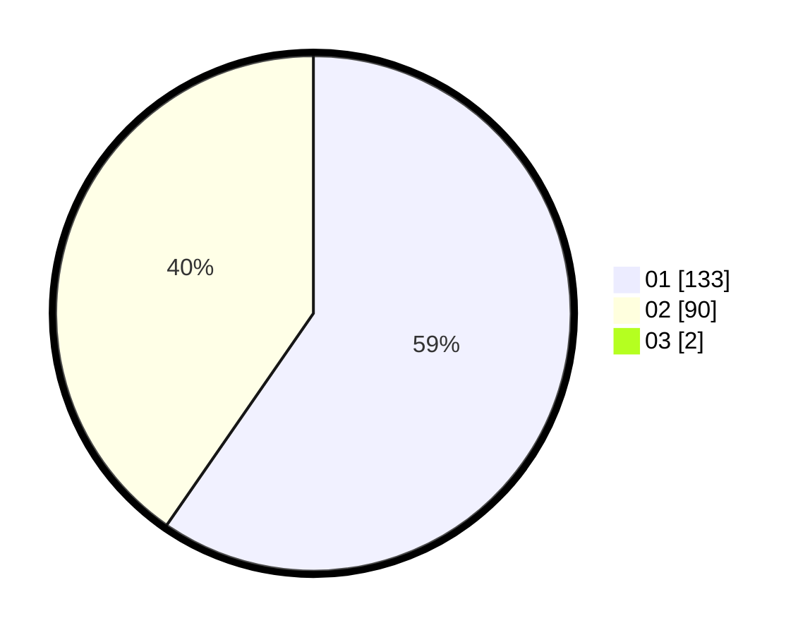

# Hasil

Hasil perolehan suara paslon dapat dilihat pada file paslon-01.txt, paslon-02.txt, dan paslon-03.txt.

Jika tidak ada, artinya data tersebut belum ada pada SIREKAP.

## Perolehan Suara

 * Paslon 01: **133**.
 * Paslon 02: **90**.
 * Paslon 03: **2**.

## Foto C Plano

https://sirekap-obj-formc.kpu.go.id/509c/pemilu/ppwp/31/75/06/10/04/3175061004143-20240215-190133--4ffa4971-3969-46f9-94bf-9f071166fc81.jpg

https://sirekap-obj-formc.kpu.go.id/509c/pemilu/ppwp/31/75/06/10/04/3175061004143-20240215-190154--5f8db0bb-1435-4c9a-bc23-ff8387da658b.jpg

https://sirekap-obj-formc.kpu.go.id/509c/pemilu/ppwp/31/75/06/10/04/3175061004143-20240215-190144--cedb9be7-cc90-42e9-a033-90dfc64deb4d.jpg

## DATA PEMILIH TETAP

Jumlah pemilih dalam DPT: **0**.
 * L: **0**.
 * P: **0**.

## DATA PENGGUNA HAK PILIH

Jumlah pengguna hak pilih dalam DPT: **0**.
 * L: **0**.
 * P: **0**.

Jumlah pengguna hak pilih dalam DPTb: **0**.
 * L: **0**.
 * P: **0**.

Jumlah pengguna hak pilih dalam DPK: **0**.
 * L: **0**.
 * P: **0**.

Jumlah pengguna hak pilih: **0**.
 * L: **0**.
 * P: **0**.

## JUMLAH SUARA SAH DAN TIDAK SAH

JUMLAH SELURUH SUARA SAH: **225**.

JUMLAH SUARA TIDAK SAH: **2**.

JUMLAH SELURUH SUARA SAH DAN SUARA TIDAK SAH: **227**.
