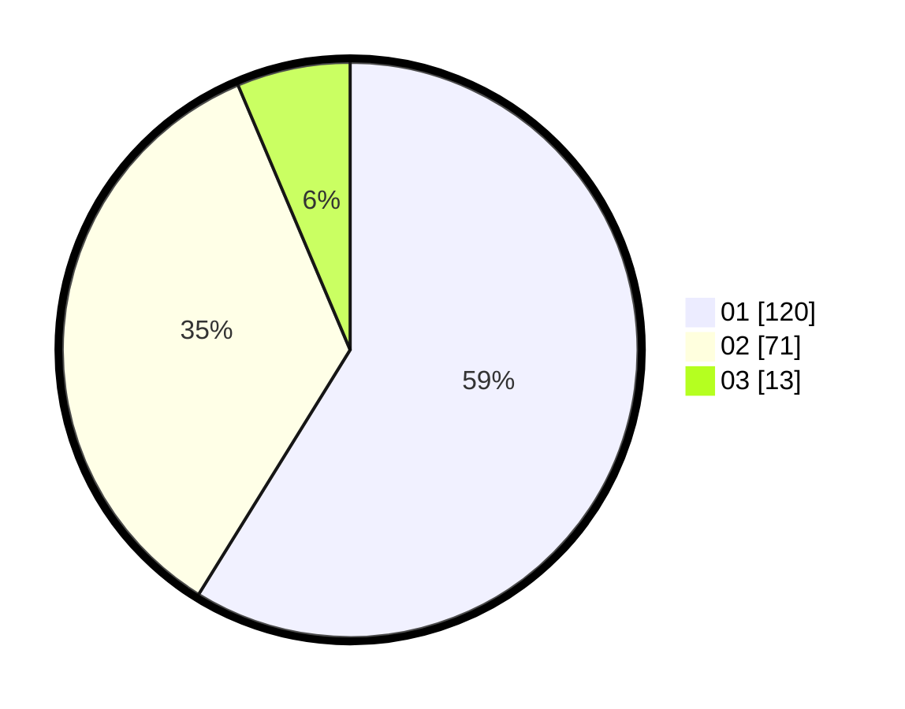

# Hasil

Hasil perolehan suara paslon dapat dilihat pada file paslon-01.txt, paslon-02.txt, dan paslon-03.txt.

Jika tidak ada, artinya data tersebut belum ada pada SIREKAP.

## Perolehan Suara

 * Paslon 01: **120**.
 * Paslon 02: **71**.
 * Paslon 03: **13**.

## Foto C Plano

https://sirekap-obj-formc.kpu.go.id/dfdd/pemilu/ppwp/31/75/06/10/04/3175061004181-20240214-155523--66ac04f8-10bd-4b0d-a8df-87ff8ffe68b4.jpg

https://sirekap-obj-formc.kpu.go.id/dfdd/pemilu/ppwp/31/75/06/10/04/3175061004181-20240214-155748--9c8c04f2-9887-4ef6-b267-7818de515cc5.jpg

https://sirekap-obj-formc.kpu.go.id/dfdd/pemilu/ppwp/31/75/06/10/04/3175061004181-20240214-160111--438046a8-2314-4051-af3d-422d731ba640.jpg

## DATA PEMILIH TETAP

Jumlah pemilih dalam DPT: **267**.
 * L: **132**.
 * P: **135**.

## DATA PENGGUNA HAK PILIH

Jumlah pengguna hak pilih dalam DPT: **205**.
 * L: **93**.
 * P: **112**.

Jumlah pengguna hak pilih dalam DPTb: **1**.
 * L: **1**.
 * P: **0**.

Jumlah pengguna hak pilih dalam DPK: **0**.
 * L: **0**.
 * P: **0**.

Jumlah pengguna hak pilih: **206**.
 * L: **94**.
 * P: **112**.

## JUMLAH SUARA SAH DAN TIDAK SAH

JUMLAH SELURUH SUARA SAH: **204**.

JUMLAH SUARA TIDAK SAH: **2**.

JUMLAH SELURUH SUARA SAH DAN SUARA TIDAK SAH: **206**.
