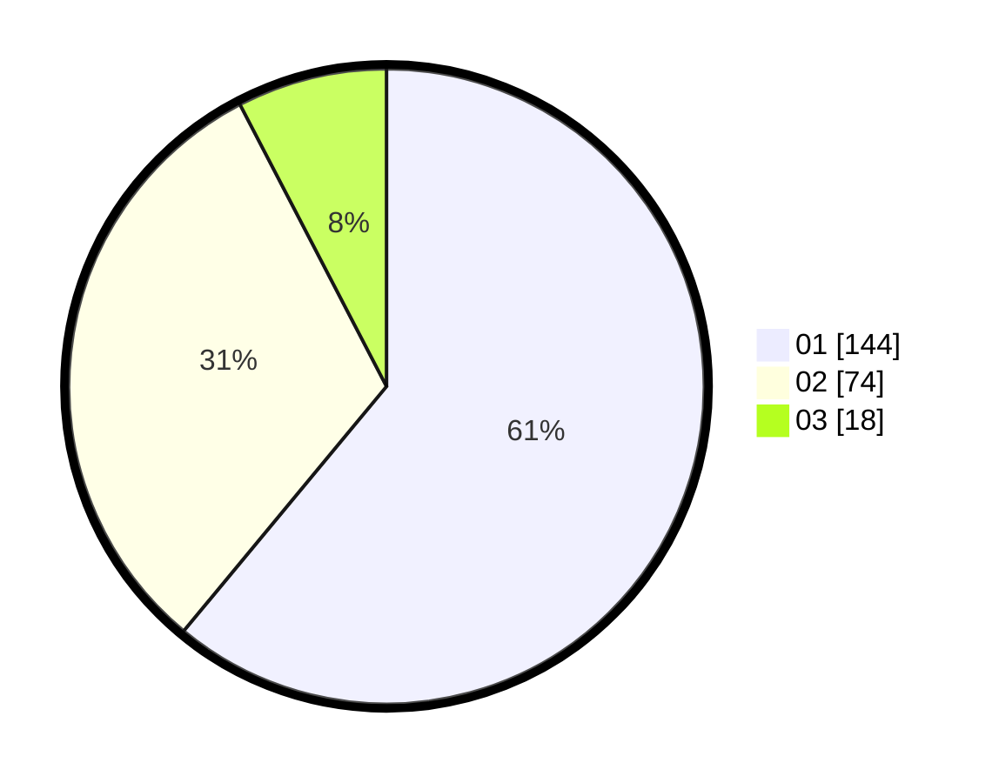

# Hasil

Hasil perolehan suara paslon dapat dilihat pada file paslon-01.txt, paslon-02.txt, dan paslon-03.txt.

Jika tidak ada, artinya data tersebut belum ada pada SIREKAP.

## Perolehan Suara

 * Paslon 01: **144**.
 * Paslon 02: **74**.
 * Paslon 03: **18**.

## Foto C Plano

https://sirekap-obj-formc.kpu.go.id/5727/pemilu/ppwp/31/75/06/10/04/3175061004192-20240216-101638--e79dad22-e9b6-413e-b5be-6f95cf40f37c.jpg

https://sirekap-obj-formc.kpu.go.id/5727/pemilu/ppwp/31/75/06/10/04/3175061004192-20240215-020931--408184bf-9dc6-4d42-972e-8f2d88c5e749.jpg

https://sirekap-obj-formc.kpu.go.id/5727/pemilu/ppwp/31/75/06/10/04/3175061004192-20240215-020936--5ef53c48-7b68-46a3-8e3c-36594fd1b8b0.jpg
