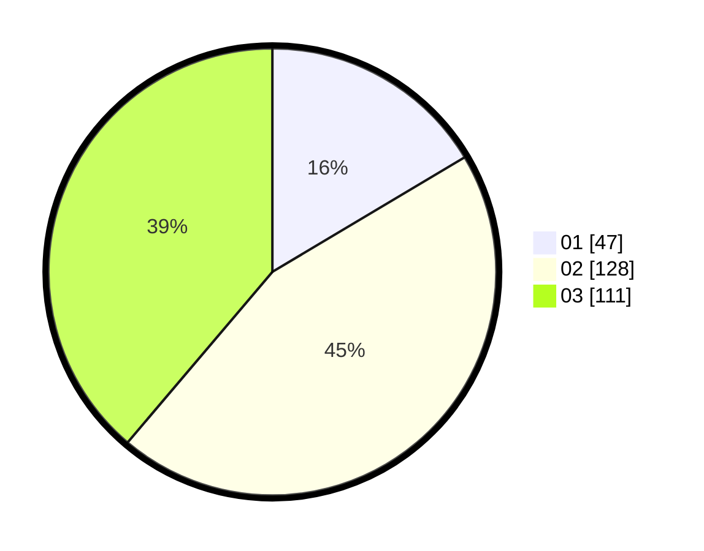

# Hasil

Hasil perolehan suara paslon dapat dilihat pada file paslon-01.txt, paslon-02.txt, dan paslon-03.txt.

Jika tidak ada, artinya data tersebut belum ada pada SIREKAP.

## Perolehan Suara

 * Paslon 01: **47**.
 * Paslon 02: **128**.
 * Paslon 03: **111**.

## Foto C Plano

https://sirekap-obj-formc.kpu.go.id/3474/pemilu/ppwp/31/75/06/10/04/3175061004202-20240214-155247--501e1507-f585-466a-a8fe-4a23c560422c.jpg

https://sirekap-obj-formc.kpu.go.id/3474/pemilu/ppwp/31/75/06/10/04/3175061004202-20240214-155348--ca6209af-7e4a-4c1e-ab5b-c315dfdc7483.jpg

https://sirekap-obj-formc.kpu.go.id/3474/pemilu/ppwp/31/75/06/10/04/3175061004202-20240214-155442--dca54556-57e9-4b93-b67b-63d733f301a9.jpg

## DATA PEMILIH TETAP

Jumlah pemilih dalam DPT: **284**.
 * L: **141**.
 * P: **143**.

## DATA PENGGUNA HAK PILIH

Jumlah pengguna hak pilih dalam DPT: **244**.
 * L: **125**.
 * P: **119**.

Jumlah pengguna hak pilih dalam DPTb: **15**.
 * L: **11**.
 * P: **84**.

Jumlah pengguna hak pilih dalam DPK: **31**.
 * L: **17**.
 * P: **14**.

Jumlah pengguna hak pilih: **290**.
 * L: **153**.
 * P: **137**.

## JUMLAH SUARA SAH DAN TIDAK SAH

JUMLAH SELURUH SUARA SAH: **286**.

JUMLAH SUARA TIDAK SAH: **4**.

JUMLAH SELURUH SUARA SAH DAN SUARA TIDAK SAH: **290**.
